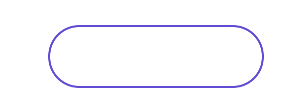
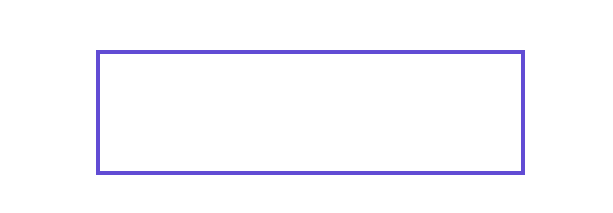
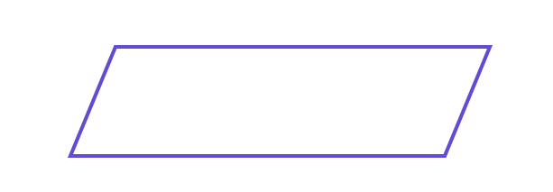
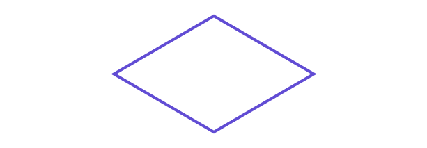
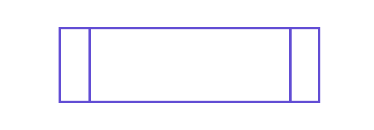
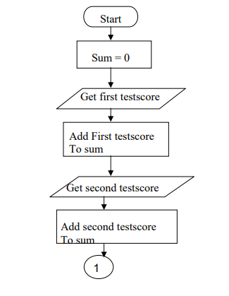
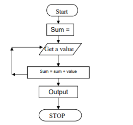
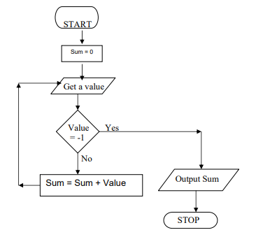

# Module 3: Algorithms

## Introduction

In programming, it's essential to write programs logically and clearly to enable effective analysis. To achieve this, concepts like **Algorithm**, **Flowchart**, and **Pseudocode** are used. This module examines algorithms for various applications and illustrates solutions with flowcharts and pseudocode.

## Learning Outcomes

By the end of this module, you will be able to:

- Outline the steps in creating algorithms  
- Explain algorithms in the context of programming  
- Recognize the importance of flowcharts and pseudocode  

# Introduction to an Algorithm

An **algorithm** is a procedure consisting of a finite set of unambiguous rules (instructions) that specify a finite sequence of operations to solve a problem or a class of problems for any allowable inputs. In other words, an algorithm is a step-by-step procedure to solve a given problem.

## Writing an Algorithm using Programming Language

An algorithm is typically written in pseudocode, mixing plain language and programming constructs, before coding the actual program.

---

## Steps to Write an Algorithm

### Step 1: Determine the outcome of your code
Identify the specific problem or task you want to accomplish.

### Step 2: Decide on a starting point
Consider:
- What data or inputs are available?
- Where is the data located?
- What formulas or rules apply?
- How do data values relate?

### Step 3: Find the ending point
Determine:
- What facts will be known at the end?
- What changes from start to finish?
- What will be added or removed?

### Step 4: List the steps from start to finish
Start broad and narrow down. For example, if your goal is to make lasagna by 7 PM:

1. Search for a recipe online.  
2. Check ingredients at home.  
3. Make a shopping list for missing ingredients.  
4. Buy ingredients.  
5. Return home.  
6. Prepare the lasagna.  
7. Bake and remove from oven.

### Step 5: Determine how to accomplish each step
Add detail to each step, considering language, resources, and efficiency.

Example (Step 1: Search for a recipe online):
- Turn on the computer.  
- Connect to the internet if needed.  
- Open a web browser.  
- Enter search terms.  
- Review recipes.  
- Filter vegetarian recipes.  
- Check servings.  
- Select appropriate recipe.

### Step 6: Review the algorithm
Ask yourself:
- Does it solve the problem?  
- Are inputs and outputs clearly defined?  
- Should the goal be more general or specific?  
- Can steps be simplified?  
- Is the outcome guaranteed to be correct?

---

## Example Algorithms

### Example #1: Going to the Market to Purchase a Pen

1. Get money.  
2. Leave the house.  
3. Walk to the market.  
4. Buy a pen.  
5. Return home.

*Note: Step 4 ("Buy a pen") could be expanded into its own detailed algorithm.*

### Example #2: Check if a Number is Positive or Negative

1. Input a number.  
2. If the number > 0, print "Positive".  
3. Else if the number < 0, print "Negative".  
4. Else, print "Zero".

---

This structured approach to algorithms helps clarify problems and create efficient solutions before programming.

## Introduction to a Flowchart

Flowcharting is a tool developed in the computer industry for showing the steps involved in a process.

A flowchart is a diagram made up of boxes, diamonds, and other shapes, connected by arrows — each shape represents a step in the process, and the arrows show the order in which they occur. Flowcharting combines symbols and flowlines to figuratively show the operation of an algorithm.

### Flowcharting Symbols

- **Terminal**: Start or end of the process  
  
  
- **Process**: Any internal operation or action  
  
  
- **Input/Output**: Data input or output operations  
  
  
- **Decision**: A binary question (Yes/No, True/False)  
  
  
- **Connector**: Connects parts of flowcharts to avoid line crossings  
  
  
- **Predefined Process**: Calls a subroutine or interrupt program  
  
---

### General Rules for Flowcharting

- Use arrows (not lines) to connect boxes.
- Entry point on top, exit on bottom except for Decision symbols (two exits).
- Flow is typically top to bottom.
- Connectors handle flow breaks or loops.
- All flowcharts start with Terminal or Predefined Process symbols.
- Flowcharts end with a Terminal or continuous loop.

---

# Examples of Algorithms and Flowcharts

---

## Example 1: Adding Test Scores

Numbers: `26, 49, 98, 87, 62, 75`

### Algorithm

    Start
    Sum = 0
    Get the first testscore
    Add first testscore to sum
    Get the second testscore
    Add to sum
    Get the third testscore
    Add to sum
    Get the fourth testscore
    Add to sum
    Get the fifth testscore
    Add to sum
    Get the sixth testscore
    Add to sum
    Output the sum
    Stop

### Corresponding Flowchart

## Example 2

Same numbers but use a loop to handle any number of scores:

    Start
    Sum = 0
    Get a value
    sum = sum + value
    Go to step 3 to get next Value
    Output the sum
    Stop

### Corresponding Flowchart

### Explanation
The flowchart includes a decision box to check if the input is the sentinel value -1.

If -1 is input, it ends by outputting the sum.

Otherwise, it adds the input value to the sum and loops back to get another input.

This guarantees the algorithm terminates when -1 is encountered.

The flowchart shows a loop that repeats endlessly, causing an infinite process. To fix this, we add a unique last value (like -1) to the list. Each time we get a value, we check if it's the last one. This makes the algorithm finite and ensures it stops after a set number of steps.

Example list:

    26, 49, 498, 9387, 48962, 1, -1

Here, -1 signals the end since all other numbers are positive.

a) Using those numbers, the algorithm looks like this:

    Start
    Sum = 0
    Get a value
    Sum =
    Sum = sum + value
    Output
    If the value is equal to –1, go to step 7
    Add to sum ( sum = sum + value)
    Go to step 3 to get next Value
    Output the sum
    Stop

## Introduction to Pseudocode

Pseudocode is a way to represent an algorithm using plain English and simple instructions. It helps programmers understand the logic of a program without worrying about specific programming syntax.

### What is Pseudocode?
- A plain language description of the steps in an algorithm.  
- Not actual code and cannot be compiled or run by a computer.  
- Easy to read and understand, even by those with basic programming knowledge.  

### Advantages of Pseudocode
- Improves readability and clarity of an algorithm.  
- Serves as a bridge between the algorithm, flowchart, and actual code.  
- Acts as documentation, making it easier for others to understand the program.  
- Helps programmers plan code before implementation.  

### How to Write Pseudocode
- Arrange tasks in logical order.  
- Start by stating the goal or purpose.  
- Use clear, simple language.  
- Follow standard programming structures like if-then, for, while, and case.  
- Use consistent naming conventions (e.g., CamelCase for functions, uppercase for constants).  
- Be detailed—don’t make it too abstract.  
- Make sure it’s finite, complete, and easy to understand for non-programmers.  

**Example**

    This program will allow the user to check

    the number whether it's even or odd

    if "1"
    print response 
        "I am case 1"

    if "2"
    print response 
        "I am case 2"