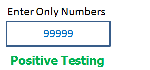
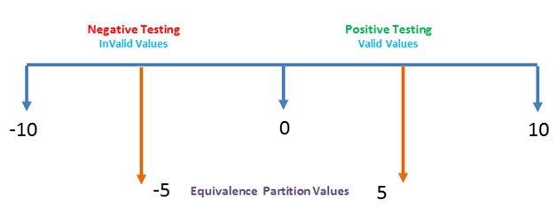

# Module 4: Testing

## Module Introduction

Testing is the process of executing a program to find errors. For software to perform well, it should be error-free. Successful testing ensures all errors are removed.

### Learning Outcomes

By the end of this module, you should be able to:

- Explain the concepts of software testing  
- Produce algorithms to compare integers  
- Distinguish between valid and invalid testing  
- Differentiate between positive and negative testing  
- Outline the importance of equivalence and boundary analysis testing  
- Design decision table testing  

### Key Terms and Concepts

- **Testing:** Measures to check the quality, performance, or reliability of something, especially before widespread use.  
- **Test Data:** Data used for testing purposes.  
- **Test Case:** A specification of inputs, execution conditions, procedures, and expected results for a single test to verify a software requirement or program path.  
- **Positive Testing:** Testing the application with valid data.  
- **Negative Testing:** Testing the application with invalid data.  
- **Boundary Value Analysis:** Testing technique that includes test cases with boundary values in a range.  
- **Equivalence Partitioning:** Dividing input data into partitions of equivalent data for deriving test cases.  
- **Decision Table Testing:** Testing technique to check system behavior for different input combinations using decision tables.  

## Software Testing

- Process of running software under positive and negative conditions (manual or automated).  
- Ensures correctness, completeness, and quality of software.  
- Critical to prevent mission failure and maintain reliability.  
- Part of software lifecycle to verify requirements are met and find defects.  
- Common testing types: unit testing, integration testing, user acceptance testing.  
- No testing method guarantees finding all defects.  
- Focus here: methods for testing algorithms.  

## Desk Check

### What is a Desk Check?  
A desk check is an informal, manual process for verifying the logic and correctness of an algorithm before programming. It helps find bugs early by simulating the algorithm step-by-step on paper, focusing on variable values and logic flow rather than inputs/outputs alone.

- Useful to detect errors in the algorithm before coding.  
- Performed using a table with columns for pseudocode line numbers, conditions, inputs/outputs, and variables.  
- The checker acts like the computer, following the algorithm rigidly to expose logical errors.  
- Desk checking is fast, inexpensive, but prone to human error.  

### Desk Checking Process (5 Steps)  
1. **Analyze the problem:** Understand all aspects of the problem clearly.  
2. **Identify a solution:** Determine inputs, functions, expected outputs.  
3. **Develop a plan:** Outline the algorithm structure using gathered data.  
4. **Design an algorithm:** Write the solution as pseudocode.  
5. **Test:** Manually simulate the algorithm to find and fix logical errors.

### Table Conditions for Desk Check  
- Number pseudocode lines for reference.  
- One column per variable, named alphabetically.  
- Show calculations/work clearly.  
- Conditions recorded as True (T) or False (F).  
- Input/output shown with format:  
  - Input: `variable ? value` (e.g., `price ? 200`)  
  - Output: `variable = value` (e.g., `discountPrice = 180`)  
- Use portrait layout, or landscape if the table is wide.

### Advantages of Desk Checking  
- Detects bugs before coding, saving time and effort.  
- Manual, inexpensive way to test logic and variables.  
- Helps spot issues an automated debugger may miss.  
- Confirms that the algorithm meets design expectations.

---

### Example 1  
**Problem:** Calculate discounted price of an item.  

**Algorithm (with line numbers):**  

    1 calcDiscountPrice()
    2 Input price, discountPercent
    3 discount = price * discountPercent / 100
    4 discountPrice = price - discount
    5 Display discountPrice
    6 STOP

**Test Data:**  
- Inputs: price = 200, discountPercent = 10  
- Expected: discount = 20, discountPrice = 180

| Line Number | Discount           | Discount Percent | Discount Price | Price | Input/Output             |
|-------------|--------------------|------------------|----------------|-------|--------------------------|
| 1           |                    |                  |                |       |                          |
| 2           |                    | 10               |                | 200   | price ? 200; discountPercent ? 10 |
| 3           | 200 * 10 / 100 = 20|                  |                |       |                          |
| 4           |                    |                  | 200 - 20 = 180 |       |                          |
| 5           |                    |                  |                |       | discountPrice = 180      |
| 6           |                    |                  |                |       |                          |

---

### Example 2  
**Problem:** Apply 15% discount if price > $100.

**Algorithm (with line numbers):**  

    1 calcPrice()
    2 Input price
    3 IF price > 100 THEN
    4 discount = price * 15 / 100
    5 price = price - discount
    6 ENDIF
    7 Display price
    8 STOP

**Test Data 1:** price = 200 → Expected price = 170  
**Test Data 2:** price = 50 → Expected price = 50  

| Line Number | Discount           | Price | Conditions      | Input/Output        |
|-------------|--------------------|-------|-----------------|---------------------|
| 1           |                    |       |                 |                     |
| 2           |                    | 200   |                 | price ? 200         |
| 3           |                    |       | 200 > 100 ? T   |                     |
| 4           | 200 * 15 / 100 = 30|       |                 |                     |
| 5           |                    | 200 - 30 = 170|         |                     |
| 6           |                    |       |                 |                     |
| 7           |                    |       |                 | price = 170         |
| 8           |                    |       |                 |                     |

## Valid and Invalid Testing

### Test Data  
Test data is essential for executing test cases and is usually documented in a Test Data Document used during test execution.

Without pre-designed test data, test cases may miss scenarios, impacting software quality.

Test data types:  
- **Valid Test Data:** Positive inputs to verify the system works as expected.  
- **Invalid Test Data:** Negative inputs to test error handling, such as:  
  - Null values in mandatory fields  
  - Out of range values  
  - Disallowed special characters  
  - Incorrect data formats (e.g., letters in a phone number)

Effective test data combines both valid and invalid inputs to cover all scenarios.

---

### Writing Test Data  
Test data should be prepared before testing and test case design to avoid delays.  

Testers usually create test data, but in sensitive fields like healthcare or banking, Business Analysts may provide masked production data.

---

### Creating Test Data  
- **Manual:** Usually made in Excel or text files based on test scenarios.  
- **Copy from Production:** Used for load or performance testing with large data sets.  
- **Automated Tools:** Tools like DTM generate test data for various testing types.

---

### Let’s take below Test Application to explain Test Data

Here are the requirements of User ID and Password:

---

---

#### User ID Requirements:  
- Minimum length is 3 characters, maximum is 15.  
- Only special character allowed is ‘_‘  
- User ID must be Unique.

#### Password Requirements:  
- Minimum length is 5 characters, maximum is 15,  
- At least 1 upper-case Alphabet,  
- At least 1 lower-case Alphabet,  
- Minimum One Number,  
- Only special characters that are allowed: ! # $ % * ? @ &

---

If we are to use the requirements mentioned above, the following Test Data would look like this:

---

---

### In conclusion
- Test Data should be updated regularly.  
- It should be created before test case execution, at the time of Test Case designing.  
- Test data should have invalid inputs to test negative scenarios.  
- Use some automation tools to create a huge amount of test data for load or stress testing.  
- Finally, it is always a better practice to include all possible combinations of supported and unsupported formats in test data. This ensures maximum test coverage.

## Positive and Negative Testing

Software testing ensures an application works as expected. It involves two main approaches:

### Positive Testing  
Provides **valid input** to verify the application behaves as expected.  
Example: Input values from `0` to `99999` in a numeric-only field.

### Negative Testing  
Uses **invalid input** to check that the system handles errors gracefully.  
Example: Input letters A–Z in a numeric-only field.

---

### Key Considerations
- **Input Data**
- **Action Performed**
- **Expected Result**

---

### Techniques

#### Boundary Value Analysis  
Test at the edges of input limits.  
Example: If valid range is `0–10`, test with `-1, 0, 1` and `9, 10, 11`.

#### Equivalence Partitioning  
Divide input into valid and invalid partitions.  
Example: Valid: `0–10`, Invalid: `<0`, pick one value from each (e.g., `5` and `-5`).

---

### Conclusion  
Use **both** positive and negative testing for full test coverage and confidence before release.

# Boundary Value Analysis (BVA) Test Case Design Technique

## Overview

Boundary Value Analysis (BVA) is a black-box test design technique focused on the boundaries between equivalence partitions. The premise is that errors are more likely to occur at the edges of input domains rather than the center.

- Every partition has maximum and minimum values.
- These edge values are known as **boundary values**.
- Tests are designed for:
  - The **minimum** value
  - Just **above** the minimum
  - A **nominal** (middle) value
  - Just **below** the maximum
  - The **maximum** value

BVA can be applied at **all levels of testing**.

---

## Example 1: Numeric Field (Age)

Assume we are testing a field that accepts ages from **18 to 56**.

- **Valid inputs**: 18, 19, 55, 56
- **Invalid inputs**: 17, 57

| Test Case | Input | Expected Result |
|-----------|-------|------------------|
| 1         | 17    | Invalid          |
| 2         | 18    | Valid            |
| 3         | 19    | Valid            |
| 4         | 55    | Valid            |
| 5         | 56    | Valid            |
| 6         | 57    | Invalid          |

- `images/boundary_example1.md`

---

## Example 2: Text Length (Name)

Assume we are testing a text field that accepts **6 to 12 characters**.

- **Valid lengths**: 6, 7, 11, 12
- **Invalid lengths**: 5, 13

| Test Case | Text Length | Expected Result |
|-----------|-------------|------------------|
| 1         | 5           | Invalid          |
| 2         | 6           | Valid            |
| 3         | 7           | Valid            |
| 4         | 11          | Valid            |
| 5         | 12          | Valid            |
| 6         | 13          | Invalid          |

- `images/boundary_example2.md`

---

## Boundary Testing

Boundary testing targets **extreme values** of input domains:

- Start / End
- Lower / Upper
- Just Inside / Just Outside

These are known as **boundary values** and typically include:

1. Minimum
2. Just above the minimum
3. A nominal value
4. Just below the maximum
5. Maximum

- `images/boundary_testing.md`

---

## Equivalence Partitioning

Equivalence Partitioning (EP) is another black-box technique where:

- Input data is divided into **equivalent partitions**
- One representative value is selected from each partition
- The assumption: if one condition works/fails, all in that class will behave the same

### Example: Order Pizza Input Field

- Valid input range: **1–10 pizzas**
- Invalid inputs: 0, 11–99, any 3-digit number (e.g., 100, -100)

| Partition        | Example Value | Expected Result |
|------------------|----------------|------------------|
| Invalid (low)    | 0              | Invalid          |
| Valid            | 1              | Valid            |
| Valid            | 10             | Valid            |
| Invalid (high)   | 11             | Invalid          |

- `images/boundary_patitioning1.md`
- `images/boundary_patitioning2.md`
- `images/boundary_patitioning3.md`

---

## Combined Use of EP and BVA

In practice, **Equivalence Partitioning** is used to identify valid and invalid ranges, and then **Boundary Value Analysis** is applied to test the edges of those ranges.

### Example: Password Length (6–10 characters)

| Test Scenario # | Description                           | Expected Outcome      |
|------------------|----------------------------------------|------------------------|
| 1                | Enter 0–5 characters                  | System should reject  |
| 2                | Enter 6–10 characters                 | System should accept  |
| 3                | Enter 11–14 characters                | System should reject  |

### Boundary Test Cases

| Boundary Value | Expected Outcome     |
|----------------|-----------------------|
| 0              | Not Accepted          |
| 1              | Valid                 |
| 2              | Valid                 |
| 9              | Valid                 |
| 10             | Valid                 |
| 11             | Not Accepted          |

---

## Importance of BVA & EP

- Reduces large test sets to manageable size
- Efficient without compromising test effectiveness
- Especially useful in **calculation-intensive applications**
- Enables clear and systematic test case design

---

## Summary

- Use **Equivalence Partitioning** to divide inputs into valid and invalid sets.
- Use **Boundary Value Analysis** to test **edges of those partitions**.
- These techniques are **complementary** and can be applied across all testing levels.

---

## Decision Table Testing

### Overview

A **Decision Table** is a tabular representation of inputs versus rules, cases, or test conditions. It is a powerful tool for:

- Complex software testing
- Requirements analysis and management

It helps testers:
- Identify all possible combinations of conditions
- Detect missed conditions easily

Conditions are typically indicated as **True (T)** and **False (F)** values.

---

### What is Decision Table Testing?

Decision Table Testing is a **black-box testing technique** used to verify system behavior for different input combinations.

Also known as a **Cause-Effect Table**, it maps:
- **Causes** (input conditions)
- **Effects** (expected system behavior)

This technique ensures comprehensive **test coverage**, especially for **complex business logic**.

---

### Example: Login Screen Decision Table

Consider a login screen with the following logic:

- If the user provides the correct username **and** password → redirect to **homepage**
- If any input is incorrect → show **error message**

#### Legend

| Symbol | Meaning                 |
|--------|--------------------------|
| T      | Correct username/password |
| F      | Wrong username/password   |
| E      | Error message is displayed |
| H      | Home screen is displayed  |

#### Decision Table

| Conditions             | Rule 1 | Rule 2 | Rule 3 | Rule 4 |
|------------------------|--------|--------|--------|--------|
| Username correct?      | F      | T      | F      | T      |
| Password correct?      | F      | F      | T      | T      |
| Expected Outcome       | E      | E      | E      | H      |

#### Interpretation

- **Rule 1**: Username and password both incorrect → Show error (E)
- **Rule 2**: Username correct, password incorrect → Show error (E)
- **Rule 3**: Username incorrect, password correct → Show error (E)
- **Rule 4**: Username and password correct → Redirect to homepage (H)

---

### Corresponding Test Scenarios

| Scenario # | Input                             | Expected Result            |
|------------|-----------------------------------|-----------------------------|
| 1          | Correct username & password       | Navigate to homepage       |
| 2          | Wrong username & password         | Show error message         |
| 3          | Correct username, wrong password  | Show error message         |
| 4          | Wrong username, correct password  | Show error message         |

---

### Importance of Decision Table Testing

- Helps test all possible **input combinations**
- Especially useful for **complex business rules**
- Provides **better coverage** than Boundary Value Analysis or Equivalence Partitioning when **system behavior differs for every input set**

> Ideal when boundary/equivalence testing is **not sufficient**, due to **unique behavior for each combination**.

---

### Advantages

- Effective when **system behavior differs for individual inputs**
- **Simple representation** makes it easy for:
  - Developers
  - Testers
  - Business analysts
- Helps create **comprehensive test combinations**
- Suitable for **100% coverage** when combinations are manageable
- Converts **complex business logic** into easy-to-understand tables

---

### Disadvantages

- Becomes **complex and unwieldy** as the number of inputs increases
- Difficult to maintain when **input conditions scale**

---

##W# Summary

Decision Table Testing is a systematic, visual method for identifying test scenarios based on various input combinations. It’s particularly useful when each combination of inputs produces a distinct outcome.

> ✅ Use it when business logic is complex.  
> ❌ Avoid it if the number of input variables is very high.

