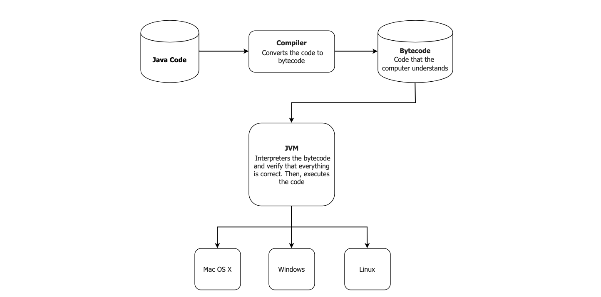

# Module 5: JDK and IDE

## Introduction

This module contains detailed information about **Java Programming Environment** concepts such as:

- **Compiler**
- **JDK**
- **JVM**
- **IDE**

For any Java programmer aiming to develop applications in Java, these are essential concepts to understand.

---

### Learning Outcomes

By the end of this module, you should be able to:

- Outline the necessity of using **operating systems**
- Implement the **programming environment**
- Explain each of the **operating systems**
- Execute the **installation of Eclipse**

# Java Programming Requirements

As we begin the practical approach to working with Java, it is important to first understand what you need.

In order to code in Java, a **programming environment** must be set up.  
We will begin by explaining how to create the perfect programming environment.

---

## Four (4) Basic Platforms for Java Programming

1. **JDK (Java Development Kit)**  
2. **IDE (Integrated Development Environment)**  
3. **Compiler**  
4. **JVM (Java Virtual Machine)**  

> **Note:** Java comes with a host of benefits, including compatibility with any operating system (Mac OS X, Windows, or Linux). One of the most significant advantages is that it is free — programming can be accomplished by simply downloading a few platforms.

---

## 1. Java Development Kit (JDK)

To code in Java, you **must have the JDK**. It is a package of tools for developing Java-based software. It includes:

- **Class libraries** to support programming
- **Compilers** to translate code into machine-readable bytecode
- The **Java Virtual Machine (JVM)** for executing the program

The JDK is available on the [Oracle website](https://www.oracle.com/java/technologies/javase-downloads.html).  
Ensure you download the version that is compatible with your operating system.

**Summary of JDK:**

- Required for programming in Java
- Enables development of Java applications
- Contains class libraries and the compiler

---

## 2. Compiler in Java

The **compiler** translates your Java code into machine-readable **bytecode (class files)**.

### Key responsibilities of the compiler:

- Checks for **syntax errors**
- Translates human-readable Java code into bytecode
- Enables **high-level programming** by managing low-level execution concerns

**Summary of Compiler:**

- Code must be error-free to compile
- Translates code into class files (bytecode)
- Part of the Java Development Kit
- Facilitates high-level, human-readable programming

---

## 3. IDE (Integrated Development Environment)

An **IDE** is a program where you write, test, and debug your code.

Modern IDEs provide:

- **Syntax highlighting**
- **Error detection**
- **Code suggestions**

### Recommended IDEs:

- **IntelliJ IDEA**
- **Eclipse**

**Summary of IDE:**

- Contains a text editor for writing code
- Provides real-time error detection and suggestions

---

## 4. JVM (Java Virtual Machine)

The **Java Virtual Machine (JVM)** is what runs the compiled bytecode (class files).  
This makes Java **platform-independent**, since the JVM interprets bytecode on any OS.

**Summary of JVM:**

- Executes bytecode (class files)
- Enables cross-platform compatibility
- Key to Java’s “write once, run anywhere” philosophy

---

## Recap: 4 Programming Environment Platforms

To code in Java:

1. **Write your Java code** in an IDE  
2. **Compiler** translates it into **bytecode (class files)**  
3. The **JVM** executes the bytecode on your system  
4. The **JDK** provides the tools that make this all possible

This setup allows your Java application to run on **any OS with a JVM**, making Java a versatile and powerful programming language.

