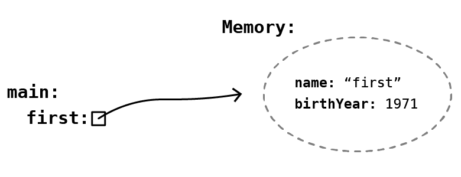
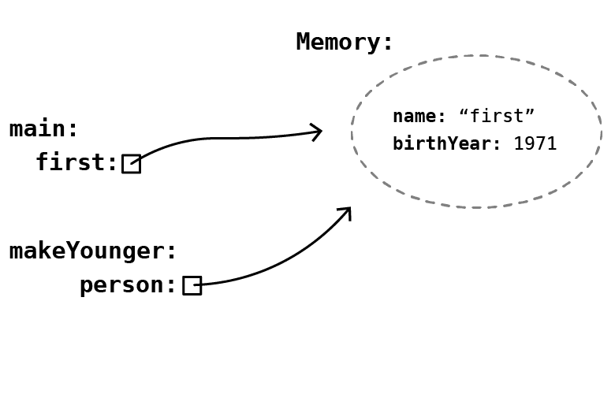
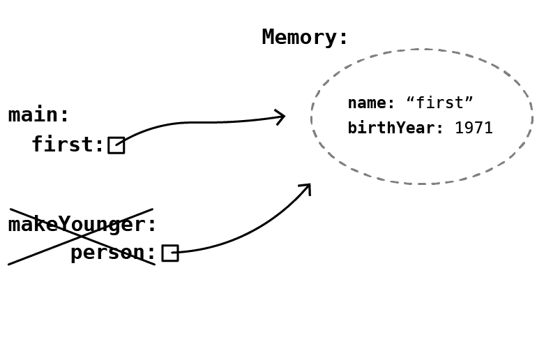
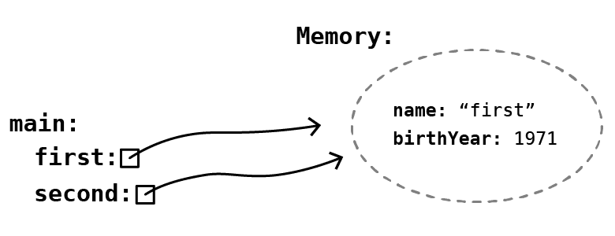
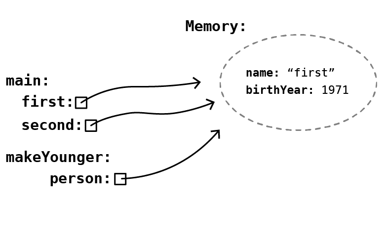

# Module 6: Sequential Statement

## Introduction

In this module, you will learn the basics of **Object-Oriented Programming** in Java, including:

- Java statements  
- Java variables  
- Java data types  
- Access modifiers  
- Variable scope  

Examples will be used throughout to illustrate these concepts in practice.

---

### Learning Outcomes

By the end of this module, you will be able to:

- Describe and manipulate data as represented in a computer, using the mathematics available within a computer.  
- Implement the solution to a given problem by writing the appropriate code in a high-level language (Java).  
- Describe in detail how data is represented in Java and manipulate that data using Java's mathematical operations.

---

### Key Terms and Concepts

**Access Modifiers**  
Access modifiers are keywords used to specify the **accessibility of a class and its members**. They determine whether parts of the code can be accessed from inside or outside the current application.

**Java Variables**  
A variable is a **container that holds a value** while a Java program is running.  
- Variables are assigned a data type.  
- A variable is essentially a **named memory location**.  
- Java has **three types of variables**:
  - Local  
  - Instance  
  - Static  

**Java Scope**  
In Java, variables are only accessible **within the region they are created**. This is known as the **scope** of the variable.

## Java Statements

A **statement** specifies an action in a Java program. For example, a statement might:

- Add the values of `x` and `y`, assigning their sum to the variable `z`
- Print a message to standard output
- Write data to a file  

Java statements can be broadly classified into three categories:

1. Declaration statements  
2. Expression statements  
3. Control flow statements  

---

### 1. Java Declaration Statement

A **declaration statement** is used to declare a variable. For example:

```java
int num;
int num2 = 100;
String str;
```

---

### 2. Java Expression Statement

An **expression** followed by a semicolon is called an **expression statement**. For example:

```java
// Increment and decrement expressions
num++;
++num;
num--;
--num;

// Assignment expressions
num = 100;
num *= 10;

// Method invocation expressions
System.out.println("This is a statement");
someMethod(param1, param2);
```

---

### 3. Java Control Flow Statement

By default, all statements in a Java program are executed **in the order they appear**. However, you may want to:

- Execute a set of statements **repeatedly**
- Execute statements **conditionally**

This is done using **control flow statements**. Examples include:

- `if` statements  
- `while` loops  
- `for` loops  

## Java Variables

Java variables are divided into **primitive** and **reference** types.

- **Primitive variables** store actual values (e.g., `int`, `boolean`, `double`).
- **Reference variables** store references (addresses) to objects.

### Key Points:

- Printing a primitive variable outputs its value directly.
- Printing a reference variable outputs the class name and hashcode by default (e.g., `Name@4aa298b7`).
- Override the `toString()` method in a class to customize how its objects print.
- Java has 8 primitive types:  
  `boolean`, `byte`, `char`, `short`, `int`, `long`, `float`, `double`.
- Assigning one primitive variable to another copies the value, not the reference.
- Passing primitives to methods copies their values; changes inside the method do not affect the original variable.

### Example of primitive copy:

```java
int first = 10;
int second = first;  // copies value 10
second = 5;         // first remains 10
``

Example of method call with primitive:

```java
public static void call(int number) {
    number = number + 1; // changes local copy only
}
```

The original ``number`` outside the method remains unchanged.

## Reference Variables in Java

- All Java variables except the eight primitive types are **reference variables**.
- Reference variables store a **reference (memory address)** to objects created from classes.
- To create a reference variable, declare its **type** and assign it a new object using a constructor.

Example:

```java
Name test = new Name("test");
```

Explanation:

1. `Name` is the class type.
2. `test` is the variable name.
3. `new Name("test")` creates a new object and returns its reference.
4. The reference is stored in `test`.

Differences from primitives:

- Primitive variables hold actual values and are immutable.
- Reference variables hold references to objects whose internal state can be changed.

Arithmetic operations work with primitives but not with reference variables.

Reference variables allow access to and modification of an object's internal state.

```java
Person person = new Person();
person.age = 30;  // Modify internal state via reference
```

### Primitive and Reference Variable as Method Parameters

# Passing Variables to Methods in Java

- Primitive variables store their actual values; reference variables store references to objects.
- Assigning with `=` copies the value from right to left (value or reference).
- When passing variables to methods, **the value is always copied**:
  - For primitives, the actual value is copied.
  - For references, the reference (pointer) is copied.
- This means the method receives its own copy of the value or reference to work with.

Example context: Assume a `Person` class is defined for further illustration.

```java
public class Person {
  private String name;
  private int birthYear;

  public Person(String name) {
     this.name = name;
     this.birthYear = 1970;
}

  public int getBirthYear() {
     return this.birthYear;
}

public void setBirthYear(int birthYear) {
     this.birthYear = birthYear;
}

public String toString() {
     return this.name + " (" + this.birthYear + ")";
   }
}
```

We'll inspect the execution of the program step by step.

```java
public class Example {
    public static void main(String[] args) {
        Person first = new Person("First");

   System.out.println(first);
   youthen(first);
   System.out.println(first);

   Person second = first;
   youthen(second);

   System.out.println(first);
 }

public static void youthen(Person person) {
person.setBirthYear(person.getBirthYear() + 1);
   }
}

Sample output

First (1970) First (1971) First (1972)
```

- Execution begins at the first line of the `main` method.
- A `Person` variable is declared and assigned the reference returned by the `Person` constructor.
- The constructor creates a `Person` object with a birth year of 1970 and a name from the parameter.
- After execution, the `main` method’s variable holds a reference to the newly created `Person` object in memory.



- Printing the `first` variable calls its `toString` method, which returns `"First (1970)"` based on the object's `name` and `birthYear`.
- Calling the `youthen` method with `first` passes a copy of the reference to the method.
- Inside `youthen`, the object's `birthYear` is incremented by one, affecting the original object since the reference points to the same memory.



- After `makeYounger` finishes, its execution context is removed from the call stack, returning control to the `main` method.
- The object referenced by `first` was mutated inside the method (its `birthYear` incremented).
- Printing `first` again shows the updated value: `"First (1971)"`.



- A new `Person` variable `second` is declared.
- The value of `first` (a reference) is copied to `second`.
- Both `first` and `second` now reference the same existing `Person` object.



- The `youthen` method is called with `second` as the argument.
- The reference value in `second` is copied and used in the method.
- The method increments the birth year of the referenced `Person` object by one.
- After returning to `main`, printing `first` shows the updated birth year: "First (1972)".



## Java Keywords Summary

Java keywords (reserved words) are predefined words that cannot be used as variable or object names. They serve specific functions in Java code:

- **abstract:** Declares abstract classes and methods.
- **boolean:** Declares boolean variables (`true`/`false`).
- **break:** Exits loops or switch statements.
- **byte:** Declares 8-bit integer variables.
- **case:** Marks blocks in switch statements.
- **catch:** Handles exceptions from try blocks.
- **char:** Declares 16-bit Unicode character variables.
- **class:** Declares a class.
- **continue:** Skips to the next iteration in loops.
- **default:** Specifies default block in switch.
- **do:** Starts a do-while loop.
- **double:** Declares 64-bit floating-point variables.
- **else:** Provides alternative branch in if statement.
- **enum:** Defines fixed sets of constants.
- **extends:** Indicates class inheritance.
- **final:** Declares constants or prevents override.
- **finally:** Executes code after try-catch regardless of exceptions.
- **float:** Declares 32-bit floating-point variables.
- **for:** Starts a for loop.
- **if:** Tests conditions.
- **implements:** Implements an interface.
- **import:** Makes classes/interfaces available.
- **instanceof:** Tests object type.
- **int:** Declares 32-bit integer variables.
- **interface:** Declares an interface with abstract methods.
- **long:** Declares 64-bit integer variables.
- **native:** Indicates a method is implemented in native code.
- **new:** Creates new objects.
- **null:** Indicates no reference.
- **package:** Declares a package.
- **private:** Access modifier; accessible only within the class.
- **protected:** Access modifier; accessible within package or subclasses.
- **public:** Access modifier; accessible everywhere.
- **return:** Returns from a method.
- **short:** Declares 16-bit integer variables.
- **static:** Declares class-level variables or methods.
- **strictfp:** Ensures consistent floating-point calculations.
- **super:** Refers to parent class object or method.
- **switch:** Executes code based on matching value.
- **synchronized:** Marks critical sections in multithreaded code.
- **this:** Refers to the current object.
- **throw:** Explicitly throws an exception.
- **throws:** Declares exceptions a method can throw.
- **transient:** Prevents serialization of a field.
- **try:** Starts a block to catch exceptions.
- **void:** Specifies no return value from method.
- **volatile:** Indicates variable may change unexpectedly.
- **while:** Starts a while loop for repeated execution.

## Modifiers Summary

**Java Modifiers** are divided into two types:

1. **Access Modifiers:** Control the accessibility of classes, methods, and variables.
   - **public:** Accessible from any other class.
   - **default:** Accessible only within the same package (when no modifier is specified).
   - **private:** Accessible only within the declared class.
   - **protected:** Accessible within the same package and by subclasses.

2. **Non-Access Modifiers:** Provide other functionalities besides access control.

---

## Access Modifiers for Classes and Members

- **public class:** Can be accessed from anywhere.
- **default class:** Accessible only within the same package.
- For attributes, methods, constructors:
  - **public:** Accessible from anywhere.
  - **private:** Accessible only within the class.
  - **default:** Accessible only within the package.
  - **protected:** Accessible within package and subclasses.

---

## Non-Access Modifiers

- For **classes:**
  - **final:** Class cannot be inherited.
  - **abstract:** Class cannot be instantiated (no objects can be created).
  
- For **attributes and methods:**
  - **final:** Cannot be overridden or modified.
  - **static:** Belongs to the class rather than instances; can be accessed without creating an object.
  - **abstract:** Used in abstract classes; methods have no body and must be implemented by subclasses.
  - **transient:** Skips serialization of fields.
  - **synchronized:** Ensures a method can be accessed by only one thread at a time.
  - **volatile:** Forces variable to be read from main memory, not cached locally by threads.

---

## Examples Highlights

- **final modifier:** Prevents reassignment of variables.
- **static modifier:** Static methods can be called without creating objects; public methods require object creation.
- **abstract class and methods:** Abstract methods have no body and are implemented by subclasses.

## Java Variable Scope

Understanding when you can use a variable depends on its **scope** in Java.

---

### Class Level Scope

Variables that need to be accessed from anywhere within a Java class should have **class-level scope**. These variables are declared **inside the class but outside of any methods**.

- Typically, class-level variables are defined at the top of the class for clarity, but they can be declared anywhere outside methods.
- These variables are accessible throughout the class.

---

### Method Scope

Variables declared **inside a method** have **method scope**. They exist only during the execution of that method.

- When the method ends, these variables are no longer accessible.
- The same variable name can be used in different methods without conflict because each is local to its own method.

Example: a variable declared inside `main()` only exists while `main()` runs.

#### Method parameters as variables

Method parameters are also variables with method scope.

Example: setter methods often take parameters that update class-level variables.

```java
public void setName(String name) {
    this.name = name;
}
```

- The `this` keyword refers to the class-level variable.
- Without `this`, the parameter `name` would refer to the method parameter, causing ambiguity.
- `this.name` accesses the class variable, while `name` alone refers to the parameter.

### Loop Scope
Variables declared inside loops (for, while) are local to the loop and cannot be accessed outside the loop.

Example 1:

```java
for (int i = 0; i < 5; i++) {
    System.out.println(i);
}
// i is NOT accessible here
```

Example 2:

```java
int i;
for (i = 0; i < 5; i++) {
    System.out.println(i);
}
// i IS accessible here
System.out.println("Last i = " + i);
```

- In the first example, i only exists within the loop.
- In the second, i is declared outside the loop and can be used afterward.


### General Rule
Curly braces `{ }` define a scope.

- You can access variables defined in the current curly braces or any outer curly braces.
- Once you leave the scope (e.g., method, loop, class block), variables declared inside are no longer accessible.
