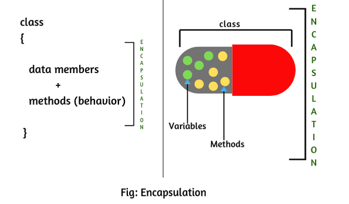

# Module 10: Abstraction and Encapsulation

## Introduction

Both **Abstraction** and **Encapsulation** are fundamental OOP concepts used to model real-world entities as objects in programming. Although they seem similar—both involve hiding details—their intents differ.

- **Abstraction** focuses on showing only relevant information by hiding unnecessary details.
- **Encapsulation** focuses on hiding the internal data from the outside world.

### Learning Outcomes

By the end of this chapter, you will be able to:
- Explain Abstraction in OOP  
- Use Abstract methods in Java  
- Explain Encapsulation  
- Implement Encapsulation in Java  
- Differentiate between Abstraction and Encapsulation  

### Key Terms and Concepts

- **Abstraction:** Managing complexity by hiding unnecessary details from users.  
- **Abstract Class:** A class that cannot be instantiated directly and must be inherited by other classes.  
- **Abstract Method:** A method declared without a body, meant to be implemented by subclasses; used only in abstract classes.  
- **Encapsulation:** Bundling data and methods that operate on that data within a single unit (e.g., a class).  
- **Data Hiding:** Restricting access to class members to protect object integrity and prevent unintended changes.

## Abstraction in Object-Oriented Programming (OOP)

Abstraction is an OOP concept that **shows only essential attributes** and **hides unnecessary details**.

- It selects relevant data from a larger set and presents only what the user needs to see.
- This helps reduce programming complexity and effort.
- The user interacts with an abstract view, not the internal workings.

**Example:**  
When driving a car, you focus on actions like starting, stopping, and accelerating, without worrying about the internal mechanics.

**Key Point:**  
Abstraction hides implementation details and exposes only the functionality — users know *what* it does, not *how* it does it.


## Ways to Achieve Abstraction in Java

There are two ways to achieve abstraction in Java:

- **Abstract class**
- **Interface**

---

### Abstract Class in Java

- A class declared with the `abstract` keyword is called an **abstract class**.
- It can have both abstract (without body) and non-abstract methods (with body).
- Abstract classes **cannot be instantiated** directly.
- They **must be extended** by subclasses, which implement the abstract methods.

#### Rules for Abstract Class

- Must be declared with the `abstract` keyword.
- Can contain abstract and non-abstract methods.
- Cannot be instantiated.
- Can have constructors and static methods.
- Can have `final` methods to prevent subclasses from changing method bodies.

#### Example

```java
abstract class A {}
```

## Abstract Class and Abstract Method Example
- An abstract class Bike has an abstract method `run()`.
- The subclass Honda4 provides the implementation of `run()`.

```java
abstract class Bike {
    abstract void run();
}

class Honda4 extends Bike {
    void run() {
        System.out.println("Test Example");
    }
    
    public static void main(String args[]) {
        Bike obj = new Honda4();
        obj.run();
    }
}
```

**Output:**

```java
Test Example
```

## Abstraction in Java – Modeling Real Things

Abstraction is the process of modeling real-world entities into programming structures. Let's walk through a simple example to demonstrate this idea:

---

### Abstracting a Real Dog into a Class

    class Dog {
    }

You begin by representing the *type* of object (a real dog) with a class in Java.

---

### Abstracting Characteristics (Fields)

    class Dog {
        String breed;
    }

Here, the `breed` field abstracts a real dog's characteristic into a class variable.

---

### Abstracting Behaviors (Methods)

    class Dog {
        String breed;

        void bark() {
            System.out.println("Gow gow!");
        }
    }

The `bark()` method abstracts a real dog's behavior into a class method.

> This class now models a real-world dog using **type**, **field**, and **method** — the essential attributes and behaviors — while hiding unnecessary internal details.

---

### Abstraction via Interfaces

You can also abstract behaviors through interfaces:

    interface Animal {
        void eat();
        void move();
        void sleep();
    }

An interface declares *what* an object can do, without specifying *how* it does it.

---

### Abstraction via Variables

Even a variable declaration is a form of abstraction:

    int numberOfLegs = 4;

You're expressing an essential detail (number of legs) without describing the internal structure of a leg.

---

### Why Abstraction Matters

Without abstraction:
- We can't identify an object via its class.
- We can't access an object's attributes.
- We can't invoke its behaviors.

---

### Conclusion

Abstraction is the foundation on which other OOP principles — such as **encapsulation**, **inheritance**, and **polymorphism** — are built.

It allows developers to:
- Focus on *what* an object does rather than *how* it does it.
- Simplify code by reducing complexity.
- Enable modular, reusable, and maintainable design.

## Encapsulation in Java

With **Abstraction** understood, let’s now focus on another core concept of Object-Oriented Programming: **Encapsulation**.

---

### What is Encapsulation?

Encapsulation is the **wrapping up of data and the methods that operate on that data into a single unit** (a class). Think of it as a protective shield that prevents direct access to an object’s internal state from outside the class.

In simpler terms, **encapsulation hides the internal details** of how an object works and **restricts direct access** to some of its components.

---

### Why Encapsulation Matters

- It **bundles** data and code together.
- It **protects** internal object state by hiding data.
- It allows **controlled access** through public methods (getters/setters).
- It improves **modularity**, **maintainability**, and **security** of code.

---

### How Encapsulation Works

Encapsulation is achieved through two key principles:

1. Declaring **all variables** in a class as **private**.
2. Providing **public getter and setter methods** to access and update private variables.

---

#### Example:

    class Student {
        private String name;
        private int age;

        public String getName() {
            return name;
        }

        public void setName(String newName) {
            name = newName;
        }

        public int getAge() {
            return age;
        }

        public void setAge(int newAge) {
            age = newAge;
        }
    }

In the above example:
- `name` and `age` are hidden from external classes.
- External code must use the `get` and `set` methods to access or modify the data.

---

### Encapsulation = Data Hiding + Abstraction

Encapsulation and abstraction often go hand-in-hand:
- **Encapsulation** focuses on hiding **data**.
- **Abstraction** focuses on hiding **implementation**.

Together, they create well-defined, secure, and flexible object structures.

---

### Visual Summary



This image illustrates how internal state and logic are shielded from the outside world, with interaction only allowed through a controlled interface.

---

### Conclusion

Encapsulation is a foundational concept in Java:
- It promotes safe, modular design.
- It prevents unintended interference with object state.
- It is essential for maintaining large-scale applications.

By combining **abstraction** and **encapsulation**, we create robust and user-friendly systems.

## Difference between Abstraction and Encapsulation

| **Aspect**                            | **Abstraction**                                                                 | **Encapsulation**                                                                 |
|--------------------------------------|----------------------------------------------------------------------------------|-----------------------------------------------------------------------------------|
| **Definition**                        | Process of hiding unwanted information and showing only relevant data.          | Process of bundling data and methods within a single unit and restricting access. |
| **Purpose**                           | Focuses on exposing what an object does.                                        | Focuses on hiding how an object does it.                                          |
| **Level of Operation**               | Solves problems at the **design/interface** level.                              | Solves problems at the **implementation** level.                                 |
| **Implementation**                   | Achieved using **abstract classes** and **interfaces**.                         | Achieved using **access modifiers** (private, protected, public).                |
| **Visibility**                        | Hides **implementation complexity**.                                            | Hides **data** using getters and setters.                                        |
| **Relationship**                      | The objects that help perform abstraction are often encapsulated.               | The objects that are encapsulated don’t necessarily use abstraction.             |
