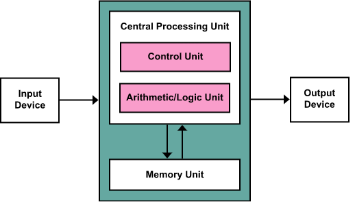
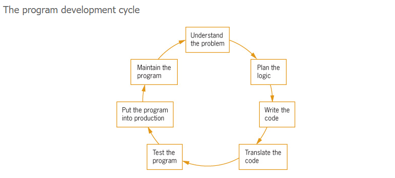

# Module 1: Introduction

## Overview
Computer programming involves giving computers instructions (code) to perform tasks or solve problems. This module introduces the basics of programming using a simple, practical approach. It sets the foundation for future programming learning.

### Learning Outcomes
By the end of this module, you will be able to:

- Explain computer systems.
- Use simple program logic.
- Outline the steps in the program development cycle.
- Recognize programming and user environments.
- Explain the evolution of programming models.

### Key Terms and Concepts

- **Computer System**: A combination of components that process and store data.
- **Hardware**: The physical equipment of a computer system.
- **Software**: Programs that instruct the computer on tasks.
- **Programs**: Sets of instructions for a computer.
- **Programming**: Writing and developing programs.
- **Application Software**: Programs that help users with tasks (e.g., word processing, accounting).
- **System Software**: Programs that manage the computer itself.
- **Input**: Entering data into memory using devices like keyboards or mice.
- **Data**: Text, numbers, or other information processed by a computer.
- **Processing**: Organizing or performing operations on data.
- **CPU (Central Processing Unit)**: Hardware component that processes data.
- **Output**: Displaying results using devices like monitors or printers.
- **Programming Language**: A language (e.g., Java, C++, Python) used to write programs.
- **Program Code**: Instructions written in a programming language.
- **Coding the Program**: Writing program statements.
- **Graphical User Interface (GUI)**: A visual interface allowing users to interact with programs.

## What Is a Computer System?

A **computer system** is a combination of all the components required to process and store data. It consists of:

- **Hardware**: The physical devices such as keyboards, mice, speakers, and printers.
- **Software**: The instructions that control hardware operations.

### Types of Software

1. **Application Software**: Programs for specific tasks like word processing, spreadsheets, inventory systems, and games.
2. **System Software**: Programs that manage the computer itself, including operating systems like Windows, Linux, Android, and iOS.

### The Three Major Operations of Computer Programs

#### 1. Input
- Data items (text, numbers, images, sounds, etc.) are entered into the system.
- Common input devices include keyboards and mice.
- Inputs are stored in memory for processing.

#### 2. Processing
- Organizes, sorts, checks accuracy, or performs calculations on data.
- Handled by the **Central Processing Unit (CPU)**.
- Devices like smartphones may contain multiple processors.

#### 3. Output
- Processed data is presented via output devices like monitors or printers.
- Enables users to view, interpret, and use results.

### Programming and Execution

- Programs are written using a **programming language** and stored in memory.
- Source code (human-readable) is translated into **object code** (machine language).
- When the computer executes the instructions, the program runs.

---



## Understanding Simple Program Logic

A program must have correct logic—instructions in the right order, no missing or extra steps.

Programs with syntax errors won’t run. Programs without syntax errors can run but may still have logic errors causing wrong output.

Most simple programs follow these steps: input, process, and output.

Example: To double a number, the program needs to input the number, multiply it by two, then output the result.

```java
Input myNumber
myAnswer = myNumber * 2
Output myAnswer
```


The number-doubling process includes three instructions:

1. **Input Operation**:  
   `Input myNumber` tells the computer to get a number from an input device (keyboard, mouse, microphone). The hardware doesn’t matter, only that a number is received.

2. **Memory and Variables**:  
   The input number is stored in a variable `myNumber`, which can hold different values each time the program runs.

3. **Processing Operation**:  
   `myAnswer = myNumber * 2` means multiply `myNumber` by 2 and store the result in `myAnswer`. Processing works the same regardless of hardware.

4. **Output Operation**:  
   The value in `myAnswer` is sent to an output device. The output stays in memory until overwritten or power is lost.

## Program Development Cycle - Key Steps

1. **Understand the problem:** Know what the user wants and the desired output.  
2. **Plan the logic:** Design the algorithm using flowcharts or pseudocode, focusing on the steps and handling all data scenarios.  
3. **Code the program:** Write the source code using a chosen programming language, following its syntax.  
4. **Translate the program:** Use a compiler or interpreter to convert code into machine language. Fix any syntax errors.  
5. **Test the program:** Debug by running the program with various data sets to find and fix errors.  
6. **Put into production:** Deploy the program for users.  
7. **Maintain the program:** Update and fix the program as needed over time.

### Note:
- Planning logic is often harder than coding.  
- Syntax errors prevent compilation.  
- Maintenance repeats the cycle for changes.

---



## Understanding Programming and User Environments

### Programming Environments  
- Program logic can be planned with flowcharts or pseudocode, by hand or using software.  
- Code is typed using text editors or an Integrated Development Environment (IDE), which combines editor, compiler, and tools.  
- IDEs help by offering features like word processors.  
- Planning logic is independent of the programming environment used to write code.  

### User Environments  
- Programs run in various environments, often via Graphical User Interfaces (GUIs) or command-line interfaces.  
- The same language can be used for both GUI and command-line programs.  
- The programming logic is the same regardless of the user environment.  

This course focuses on programming logic, not on specific development or user environments.

