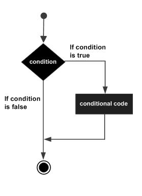
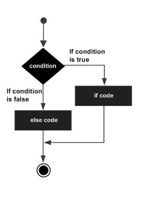
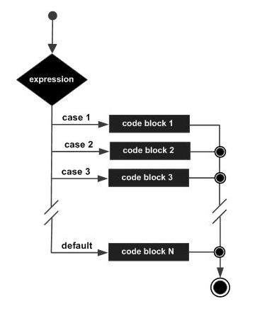

# Module 7: Decision Making by Java Programming

## Introduction

Decision Making is the process of making choices by identifying a decision, gathering information, and assessing alternative resolutions. This process is similar in Java. With programming, you are faced with situations where you want a certain block of code to be executed when some condition is fulfilled.

## Learning Outcomes

Upon completion of this module, you will be able to:

- Explain decision making
- Outline the importance of Java Statements in making decisions

## Decision Making in Java

Decision Making is a process in which a condition is evaluated, and based on a true/false result, the program direction to execute is received. Mainly **if-else** and **switch case** statements are responsible for decision making in Java.

The following image illustrates the general form of a typical decision-making structure found in most programming languages:

*(Insert image here)*

Java programming language provides the following types of decision-making statements:

- If statement
- If else statement
- If...else if...else Statement
- Nested if statement
- Switch statement


Let’s explain these statements in greater detail.

---

### 1. if statement in Java

An if statement consists of a Boolean expression followed by one or more statements.

**Syntax:**

```java
if(Boolean_expression) {
    // Statements will execute if the Boolean expression is true
}
```

If the Boolean expression evaluates to true, then the block of code inside the if statement will be executed. If not, the first set of code after the end of the if statement (after the closing curly brace) will be executed.

It can be illustrated as follows:



```java
public class Test {
    public static void main(String args[]) {
        int x = 10;

        if( x < 20 ) {
            System.out.print("This is if statement");
        }
    }
}
```

### 2. if-else statement in Java

An if statement can be followed by an optional else statement, which executes when the Boolean expression is false.

```java
if(Boolean_expression) {
    // Executes when the Boolean expression is true
} else {
    // Executes when the Boolean expression is false
}
```

If the Boolean expression evaluates to true, the if block of code will be executed; otherwise, the else block will be executed.

The if…else statement can be illustrated as follows:



```java
public class Test {
    public static void main(String args[]) {
        int x = 30;

        if( x < 20 ) {
            System.out.print("This is if statement");
        } else {
            System.out.print("This is else statement");
        }
    }
}
```

### 3. The if...else if...else Statement

An if statement can be followed by optional else if...else statements, which are useful to test various conditions using a single if...else if statement.

Points to consider:

- An if can have zero or one else, and it must come after any else if's.
- An if can have zero to many else if's, and they must come before the else.
- Once an else if succeeds, none of the remaining else if's or else's will be tested.

```java
if(Boolean_expression1) {
    // Executes when Boolean_expression1 is true
} else if(Boolean_expression2) {
    // Executes when Boolean_expression2 is true
} else if(Boolean_expression3) {
    // Executes when Boolean_expression3 is true
} else {
    // Executes when none of the above conditions are true
}
```

**Example:**

```java
public class Test {
    public static void main(String args[]) {
        int x = 30;

        if( x == 10 ) {
            System.out.print("Value of X is 10");
        } else if( x == 20 ) {
            System.out.print("Value of X is 20");
        } else if( x == 30 ) {
            System.out.print("Value of X is 30");
        } else {
            System.out.print("This is else statement");
        }
    }
}
```

### 4. Nested if statement

It is possible to nest if-else statements, meaning you can use one if or else if statement inside another if or else if statement.

**Syntax:**

```java
if(Boolean_expression1) {
    // Executes when Boolean_expression1 is true
    if(Boolean_expression2) {
        // Executes when Boolean_expression2 is true
    }
}
```

You can nest else if...else in a similar way.

**Example:**

```java
public class Test {
    public static void main(String args[]) {
        int x = 30;
        int y = 10;

        if( x == 30 ) {
            if( y == 10 ) {
                System.out.print("X = 30 and Y = 10");
            }
        }
    }
}
```

### 5. Switch statement in Java

A switch statement allows a variable to be tested for equality against a list of values. Each value is called a case, and the variable being switched on is checked for each case.

**Syntax:**

```java
switch(expression) {
    case value:
        // Statements
        break; // optional

    case value:
        // Statements
        break; // optional

    // You can have any number of case statements.

    default: // Optional
        // Statements
}
```



**Example:**

```java
public class Test {
    public static void main(String args[]) {
        // char grade = args[0].charAt(0);
        char grade = 'C';

        switch(grade) {
            case 'A':
                System.out.println("Excellent!");
                break;
            case 'B':
            case 'C':
                System.out.println("Well done");
                break;
            case 'D':
                System.out.println("You passed");
            case 'F':
                System.out.println("Better try again");
                break;
            default:
                System.out.println("Invalid grade");
        }
        System.out.println("Your grade is " + grade);
    }
}
```

### The Conditional Operator ? :

The conditional operator `?` was discussed in the previous module and can be used to replace if...else statements. It has the following general form:

    Exp1 ? Exp2 : Exp3;

Where Exp1, Exp2, and Exp3 are expressions. Notice the use and placement of the colon.