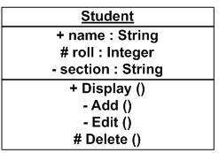
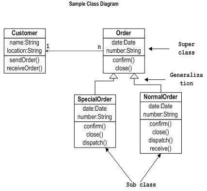

# Module 9: Objects, Classes, UML Diagrams

## Introduction to Java Objects and Classes

In this module, we focus on Java objects and classes. In object-oriented programming, programs are designed using objects and classes. An **object** in Java is both a physical and logical entity, whereas a **class** is only a logical entity.

---

### Learning Outcomes

Upon completion of this chapter, you will be able to:

- Explain Java Objects and Classes  
- Identify the characteristics of objects  
- Outline ways to initialize an object  
- Explain UML Diagrams  
- Outline the 4 parts of a UML Class  
- Identify different Notations  
- Create Classes  
- Construct Programs  

---

### Key Terms and Concepts

- **Class:** Describes the contents of objects that belong to it. It defines data fields (called *instance variables*) and operations (called *methods*).  
- **Object:** An element (or instance) of a class, with behaviors defined by the class. Objects are the actual components of programs, while the class specifies how instances are created and behave.  
- **Method:** An action that an object can perform.  
- **UML:** Unified Modeling Language, a standard way to visualize the design of a software system.

### Objects and Classes in Java
We know that in object-oriented programming, we design a program using objects and classes.

An object in Java is the physical as well as a logical entity, whereas, a class in Java is a logical entity only.

## What is an Object in Java

An **object** is an entity that has a **state** and **behavior**. It can be physical or logical (tangible or intangible).

### Characteristics of an Object

- **State:** Represents the data (value) of an object.  
- **Behavior:** Represents the functionality of an object (e.g., deposit, withdraw).  
- **Identity:** Each object has a unique ID used internally by the JVM to identify it; this ID is not visible externally.

> **Image source:** [javatpoint - Object and Class in Java](https://www.javatpoint.com/object-and-class-in-java)

An object is an **instance** of a class. A class is a template or blueprint from which objects are created.

### Object Definitions

- An object is a real-world entity.  
- An object exists at runtime.  
- An object has a state and behavior.  
- An object is an instance of a class.

---

## What is a Class in Java

A **class** is a group of objects with common properties. It acts as a template or blueprint for creating objects. It is a logical entity only.

### Contents of a Class

- Fields  
- Methods  
- Constructors  
- Blocks  
- Nested classes and interfaces  

### Syntax to declare a class

```java
class <class_name> {
    field;
    method;
}
```

## Instance Variable in Java
A variable declared inside the class but outside any method is called an instance variable. It receives memory at runtime when an object is created.

## Method in Java
A method is like a function used to expose the behavior of an object.

Advantages:

- Code reusability
- Code optimization

## new Keyword in Java
The new keyword allocates memory at runtime in the Heap memory area for objects.

**Example: Defining a Class and Creating an Object**

```java
class Student {
    int id;           // field or instance variable
    String name;

    public static void main(String args[]) {
        Student s1 = new Student();   // creating an object
        System.out.println(s1.id);    // prints default value 0
        System.out.println(s1.name);  // prints default value null
    }
}
```

**Example: Using Main Method Outside Class**

```java
class Student {
    int id;
    String name;
}

class TestStudent1 {
    public static void main(String args[]) {
        Student s1 = new Student();
        System.out.println(s1.id);    // prints 0
        System.out.println(s1.name);  // prints null
    }
}
```

## Initializing an Object
There are 3 ways to initialize an object in Java:

1. By reference variable
2. By method
3. By constructor

### 1) Initialization through Reference Variable

```java
class Student {
    int id;
    String name;
}

class TestStudent2 {
    public static void main(String args[]) {
        Student s1 = new Student();
        s1.id = 101;
        s1.name = "Sonoo";
        System.out.println(s1.id + " " + s1.name);
    }
}
```

**Multiple Objects Example**

```java
class Student {
    int id;
    String name;
}

class TestStudent3 {
    public static void main(String args[]) {
        Student s1 = new Student();
        Student s2 = new Student();
        s1.id = 101;
        s1.name = "Sonoo";
        s2.id = 102;
        s2.name = "Amit";
        System.out.println(s1.id + " " + s1.name);
        System.out.println(s2.id + " " + s2.name);
    }
}
```

### 2) Initialization through Method

```java
class Student {
    int rollno;
    String name;

    void insertRecord(int r, String n) {
        rollno = r;
        name = n;
    }

    void displayInformation() {
        System.out.println(rollno + " " + name);
    }
}

class TestStudent4 {
    public static void main(String args[]) {
        Student s1 = new Student();
        Student s2 = new Student();
        s1.insertRecord(111, "Karan");
        s2.insertRecord(222, "Aryan");
        s1.displayInformation();
        s2.displayInformation();
    }
}
```

### 3) Initialization through Constructor

```java
class Student4 {
    int id;
    String name;

    Student4(int i, String n) {  // constructor with parameters
        id = i;
        name = n;
    }

    void display() {
        System.out.println(id + " " + name);
    }

    public static void main(String args[]) {
        Student4 s1 = new Student4(111, "Karan");
        Student4 s2 = new Student4(222, "Aryan");
        s1.display();
        s2.display();
    }
}
```

**Default Constructor**

```java
class Student3 {
    int id;
    String name;

    void display() {
        System.out.println(id + " " + name);
    }

    public static void main(String args[]) {
        Student3 s1 = new Student3();
        Student3 s2 = new Student3();
        s1.display();
        s2.display();
    }
}
```

## UML Diagram Overview

- **UML (Unified Modeling Language)** is a standardized language used to specify, visualize, construct, and document software and non-software systems.  
- Originally developed to capture the behavior of complex systems, UML is now an OMG (Object Management Group) standard.

### UML Architecture

- Systems have different users (developers, testers, business analysts, etc.), so architecture must consider multiple perspectives.  
- UML helps visualize a system from these perspectives:
  - **Design:** focuses on classes, interfaces, collaborations (supported by class and object diagrams).  
  - **Implementation:** shows physical components assembled (supported by component diagrams).  
  - **Process:** defines system flow (uses design elements).  
  - **Deployment:** represents physical hardware nodes (supported by deployment diagrams).  
- The **Use Case view** is central, connecting all perspectives by representing system functionality.

### UML Basic Notations

- UML’s strength lies in its clear diagrammatic notations that model system components and relationships.  
- Effective use of notations is critical to creating meaningful models.  
- Notations must be well understood and used appropriately from the start.  
- UML is extensible, making it powerful and flexible.  
- Basic structural notations in UML (the “nouns” of UML) include:
  - Classes  
  - Objects  
  - Interfaces  
  - Collaborations  
  - Use cases  
  - Active classes  
  - Components  
  - Nodes

### Class Notation


### Object Notation


### Drawing a Class Diagram


