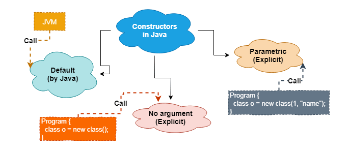
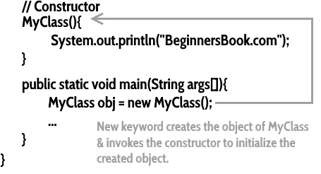
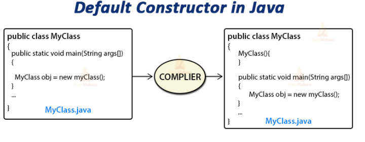
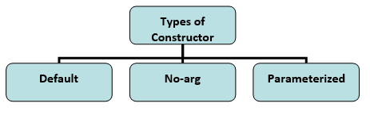
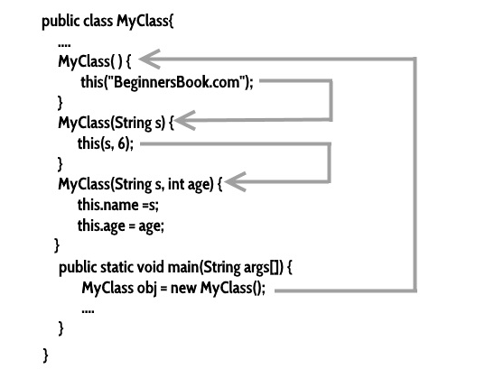
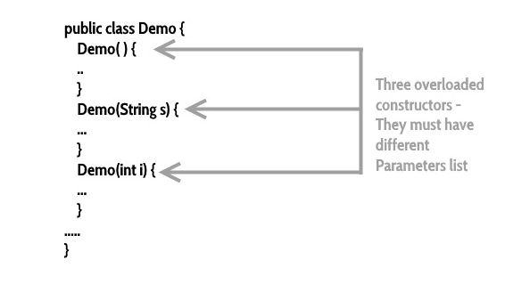

# Module 11: Constructors, Accessors, Mutators, Methods

## Introduction

Java offers several features that simplify and enhance application development. Among these are **Constructors**, **Accessors**, and **Mutators**, which are the focus of this module.

### Learning Outcomes

By the end of this chapter, you will be able to:
- Explain the concept of a Java **Constructor**
- Outline the different **types of Constructors**
- Explain the concepts of Java **Accessor** and **Mutator** methods

## Introduction to Java Constructor

In Java, a **constructor** is a special block of code that runs when a new object is created. It looks similar to a method but is **not** a method—it does **not have a return type**, not even `void`.

Key points:
- A constructor initializes an object at the time of creation.
- It has the **same name as the class**.
- It is syntactically similar to a method, but with **no return type**.



## Purpose of a Constructor in Java

A **constructor** is used to initialize the instance variables of a class or perform necessary start-up procedures when an object is created.

### Key Points
- Every class in Java has a constructor. If none is defined, Java provides a **default constructor** that sets variables to default values (e.g., 0 or null).
- Once you define your own constructor, the default constructor is no longer used.
- Constructors ensure that objects are **properly initialized** at the time of creation.

### Syntax
```java
class ClassName {
    ClassName() {
        // initialization code
    }
}
```

### Example Use Case
For a Box class with variables like length, width, and height, a constructor ensures these dimensions are assigned values when a Box object is created. An object without initialized values would not make sense in such a case.

## How Does a Constructor Work in Java?

When you create an object in Java using the `new` keyword, the constructor is automatically invoked to initialize the object.

### Example
```java
MyClass obj = new MyClass();
```

- `new MyClass()` creates the object and calls the constructor.
- The constructor assigns initial values to instance variables.

### Sample Program

```java
public class Hello {
    String name;

    // Constructor
    Hello() {
        this.name = "BeginnersBook.com";
    }

    public static void main(String[] args) {
        Hello obj = new Hello();
        System.out.println(obj.name);
    }
}
```

**Output:**


## Types of Constructors in Java

Java provides three types of constructors:

1. **Default Constructor**  
   - Automatically provided by Java if no constructor is defined.
   - Initializes instance variables with default values.

    

2. **No-Arg Constructor**  
   - A constructor defined with no parameters.
   - Often used to assign default values explicitly.

    ```java
    class Demo
    {
        public Demo() {
        System.out.println("This is a no argument constructor");
        }
            public static void main(String args[]) {
                                new Demo();
        }
    }
    ```

3. **Parameterized Constructor**  
   - Takes arguments to initialize objects with specific values.
   - Allows greater flexibility and control over object initialization.

    ```java
    public class Employee {

        int empId;
        String empName;

            //parameterized constructor with two parameters
            Employee(int id, String name) {
            this.empId = id;
            this.empName = name;
        }

        void info() {
            System.out.println("Id: "+empId+" Name: "+empName);
        }

        public static void main(String args[]) {
            Employee obj1 = new Employee(10245,"Chaitanya");
            Employee obj2 = new Employee(92232,"Negan");
                    obj1.info();
                    obj2.info();
        }
    }
    ```



### Constructor Chaining
When A constructor calls another constructor of same the class, then this is called constructor chaining.



### Super()

In Java, when a **child class constructor** is invoked, it **implicitly calls the constructor of its parent class**. This is done using the `super()` call, which the compiler inserts automatically at the beginning of the child constructor if it's not explicitly written.

***Example:***

```java
class MyParentClass {
   MyParentClass() {
      System.out.println("MyParentClass Constructor");
   }
}

class MyChildClass extends MyParentClass {
   MyChildClass() {
      // super(); is called implicitly here
      System.out.println("MyChildClass Constructor");
   }

   public static void main(String[] args) {
      new MyChildClass();
   }
}
```

### Constructor Overloading
Constructor overloading is a concept of having more than one constructor with different parameters list, in such a way that each constructor performs a different task.



## Java Accessor and Mutator Methods

In Java, **accessor** and **mutator** methods are used to access and modify private fields of a class, supporting the principle of **encapsulation** in OOP.


### Accessors (Getters)

- Also known as **get methods**.
- Used to **return the value of a private field**.
- Declared as `public`.
- Follow the naming convention: `getFieldName()`.
- Return the same data type as the field they access.

**Syntax:**
```java
public int getNumber() {
    return number;
}
```

**Example:**
```java
public class Employee {
    private int number;

    public int getNumber() {
        return number;
    }

    public void setNumber(int newNumber) {
        number = newNumber;
    }
}
```

### Mutators (Setters)
- Also known as set methods.
- Used to modify or set the value of a private field.
- Declared as public, with no return type (void).
- Follow the naming convention: setFieldName(type value).
- Accept a parameter of the same data type as the field.

**Syntax:**
```java
public void setAge(int age) {
    this.age = age;
}
```

**Example:**
```java
public class Cat {
    private int age;

    public int getAge() {
        return this.age;
    }

    public void setAge(int age) {
        this.age = age;
    }
}
```

### Purpose of Accessors and Mutators

Accessors and Mutators help enforce **data hiding** in Java by:

- Preventing illegal or unintended access to private fields.
- Allowing **validation** of input values when modifying fields.

---

#### Key Differences

| Aspect              | Accessor (Getter)        | Mutator (Setter)         |
|---------------------|--------------------------|---------------------------|
| Returns a value     | ✅ Yes                   | ❌ No                     |
| Modifies a field    | ❌ No                    | ✅ Yes                    |
| Example method      | `getPriority()`          | `setPriority()`           |

Both methods are used in the `Thread` class (in `java.lang`) to retrieve and set thread names or priorities.


