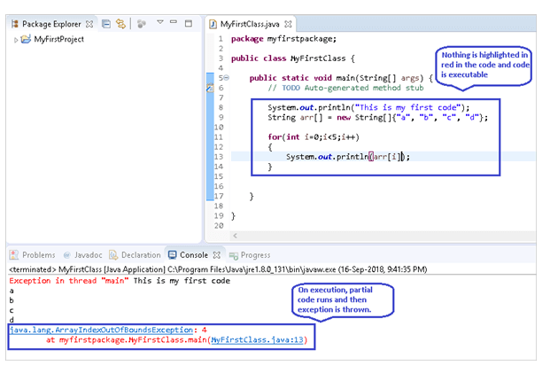
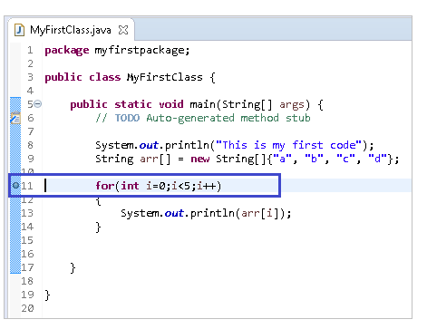
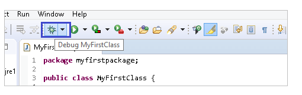
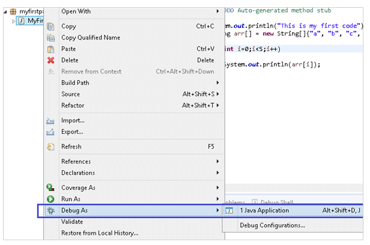
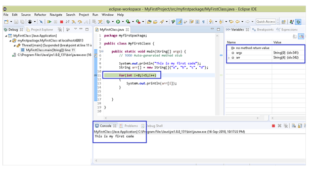
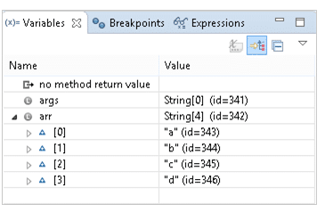

# Module 12: Debugging

## Introduction to Debugging in Java

Debugging is the process of locating and fixing bugs or errors in a program. It's a critical skill for Java developers to uncover issues that may not appear during code reviews or under normal conditions. The Eclipse Java IDE offers robust tools in its **Debug Perspective** to assist in this process.

---

### Learning Outcomes

After this chapter, you will be able to:

- Explain the concept of debugging.
- Add and manage breakpoints in Java code.
- Manually debug a Java program step by step.

---

### Key Terms and Concepts

- **Debugging**: Identifying and fixing errors in software.
- **Breakpoints**: Points in the code where execution will pause for debugging.
- **Step-into**: Executes the current line; if it's a method, steps into it.
- **Step-over**: Executes the current line without entering any called methods.
- **Call Stack**: A runtime view of active method calls leading to the current execution point.

## What is Debugging?

Debugging is the process of executing your code **line by line** to observe how it runs and to inspect variables and their values at different stages.

- It is primarily used to identify and fix **runtime errors**.
- Unlike **compile-time errors**, which are flagged by the IDE (e.g., Eclipse) and prevent the program from running, runtime errors require manual inspection—this is where debugging becomes essential.

```java
package myfirstpackage;

   public class MyFirstClass {

   public static void main(String[] args) {
   // TODO Auto-generated method stub

   System.out.println("This is my first code")
  }
}
```

The code above illustrates an error, however, if you have runtime exceptions, then they may not be highlighted in the code, instead, when you run the code, your program will fail due to this exception.



## The Breakpoint

A **breakpoint** allows you to take manual control of your program during execution by pausing the code at a specific line.

- To add a breakpoint, **double-click the left margin** next to the desired line, creating a blue circle.
- Right-clicking the blue circle lets you **toggle** or **disable** the breakpoint.
- You can also add a breakpoint by placing the cursor on the line and pressing **SHIFT + CTRL + B**.
- Place breakpoints at locations where you want to inspect the code, such as inside loops where exceptions or errors occur.



## Running the Code in Debug

Once you have placed breakpoints and are ready to debug your program, follow these steps to run the code in debug mode:

- Click the **Debug** icon in the toolbar.



- Alternatively, right-click the class name in the Project Explorer, then select **Debug As → Java Application**.




When running in debug mode:

- The execution stops at the breakpoint, which is highlighted.
- Statements before the breakpoint execute and print output to the console, while those after do not until you proceed.
- Variables up to the breakpoint are shown in the **Variables** section; expanding arrays or objects reveals their contents.

To proceed through the code (e.g., enter loops), use the debugging key controls (step-into, step-over, etc.).



## Stepping Commands in Eclipse Debugger

Eclipse provides toolbar buttons and keyboard shortcuts to control program execution during debugging.

### F5 – Step Into
- Executes the current line and moves inside any called methods or loops.
- Allows you to observe variable values and execution flow line-by-line.
- Useful for inspecting code inside loops or method calls.
- When the code reaches an error, Eclipse shows the exact line where it breaks.

### F6 – Step Over
- Executes the current line but skips stepping into methods.
- Runs code normally until the next line after the current statement.
- Useful to quickly execute code without entering every method.

### F7 – Step Out (Step Return)
- Completes execution of the current method and returns to the caller.
- Handy when you want to exit the current method and continue debugging at the higher level.

### F8 – Resume
- Continues running the program until the next breakpoint or program end.
- Useful for skipping over sections of code you don’t need to debug line-by-line.
