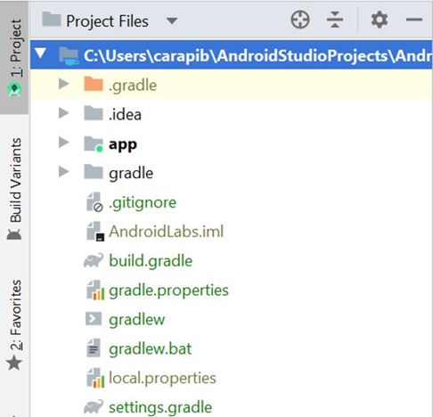

# 📱 Module 1: Introduction to Android Studio

## 🧭 Introduction

Android Studio is the official integrated development environment (IDE) for Google's Android operating system. It is built on JetBrains' IntelliJ IDEA and tailored specifically for Android development. Android Studio is available for Windows, macOS, and Linux and provides tools for code editing, debugging, testing, and profiling, all designed to help you build high-quality Android apps efficiently.

The global demand for software engineers continues to rise, especially for Android developers. With over 6,000 apps released daily to the Google Play Store, acquiring Android development skills significantly boosts your employability in the tech industry.

In this module, you'll learn how to install Android Studio, create your first project, and explore the environment to understand its key features and components.

---

## 🎯 Learning Outcomes

By the end of this module, you should be able to:

- ✅ Install Android Studio on your system  
- ✅ Construct your first Android application  
- ✅ Differentiate between Java source files and layout (XML) files  
- ✅ Identify multilingual string resource files  
- ✅ Submit code to GitHub using version control tools  
- ✅ Design and configure an Android Virtual Device (AVD)  
- ✅ Use the Android Studio debugger effectively  

---

## 🗝️ Key Terms and Concepts

### 📌 Android Studio
The official IDE for Android development, offering a rich suite of tools built on IntelliJ IDEA.

### 📌 Integrated Development Environment (IDE)
A software application that provides comprehensive tools for programming, including a code editor, build automation tools, and a debugger.

### 📌 GitHub
A web-based platform for version control and collaboration using Git. Acquired by Microsoft in 2018, GitHub allows developers to host, share, and manage source code.

---

## 🧪 Suggested Practice

- Download and install Android Studio  
- Create a "Hello World" Android app  
- Explore the project structure (Java files, XML layout files, `AndroidManifest.xml`)  
- Push your project to a GitHub repository  
- Create and run your first AVD  
- Use the debugger to set breakpoints and inspect variable values  

---

## 📚 Additional Resources

- [Download Android Studio](https://developer.android.com/studio)  
- [Android Developer Documentation](https://developer.android.com/docs)  
- [GitHub Getting Started Guide](https://docs.github.com/en/get-started/quickstart)  

---

## 🧱 Background

Android is a Linux-based operating system with a graphical desktop manager. It is optimized for mobile touchscreen devices and is designed for low energy usage to maximize battery life.

Android Inc. was a company founded by Andy Rubin, which Google acquired in 2005. Google offers Android for free to manufacturers and monetizes it through services and advertising.

---

## 🔢 Android Versions

Android has gone through many versions, each introducing new features:

- `AsyncTask` was introduced in API level 3  
- `DownloadManager` was introduced in API level 9  
- `GridLayout` was introduced in API level 14  
- `NetworkServiceDiscovery` was introduced in API level 16  
- OpenGL 3.0 and support for 4K displays were introduced in API level 18  

> 🧠 **Note:** Each new Android version adds additional features and capabilities for developers.

---

## 🧰 Android Studio Installation

To follow along with this course, you’ll need to install Android Studio:

- 📥 [Download Android Studio](https://developer.android.com/studio)

---

## 🗃️ Git Installation

You’ll also need Git for version control. If you’ve never installed Git before, visit the official site and select the appropriate version for your operating system:

- 📥 [Download Git](https://git-scm.com/downloads)

---

## 🛠️ Application Development

Originally, Android development was done using **Eclipse**. Developers wrote code in Java, which was then deployed to an Android Virtual Machine (emulator). 

> ⚠️ **Note:** If you encounter tutorials using Eclipse, it's best to disregard them—they're outdated.

Today, **Android Studio** (built on IntelliJ IDEA) is the standard tool for Android development. It includes an integrated emulator and robust tools for code editing, debugging, and testing.

---

## ☕ Java Development

Android uses a **subset of the Java programming language**. Initially, Android ran interpreted Java bytecode, but starting with Android 4.4, it adopted **ahead-of-time (AOT) compilation**, where code is compiled during app installation.

There are many versions of Android in circulation—currently up to **Android 10 (API level 29)**—and each new version introduces more advanced features and APIs.

## 🚀 Your First Application

Now that you understand the basics of Android and have installed the required tools, you’re ready to build your first app.

### Step 1: Launch Android Studio

- Open **Android Studio** on your computer.
- From the startup window, select **“Start a new Android Studio project”**.

### Step 2: Configure the New Project

- Choose **“Empty Views Activity”** as the project type.
- Set a **project name** of your choice.
- Select **Java** as the programming language.
- Choose **API level 23** as the minimum supported version.
  - Android Studio will indicate the approximate number of devices your app can support at this API level.

---

## 🧭 Exploring the Android Studio Interface

As you familiarize yourself with the IDE, take note of the following:

- **Project Location:**  
  Your project is usually stored in a directory like `AndroidStudioProjects` in your home folder. You can see this path at the top of the interface.

- **File Views:**  
  Android Studio allows you to switch how project files are displayed:
  
  - **Android View:** Groups files logically based on their usage (e.g., layouts, Java files, manifests).
  - **Project Files View:** Shows the actual file structure on disk.  
    You can switch views using the dropdown in the top-left corner of the file browser pane.

> 📌 Tip: Use the **Project Files view** if you want to understand where files are truly stored on disk, which can be helpful for version control or manual file edits.

## 🗂️ Java, Layout, and XML Files

---

### 📄 Java Files

In the **Android view**, navigate to the `java/` folder and locate your package directory. You should see a file named `MainActivity.java`.  
Double-click on it to view the contents.


---

### 🧱 Layout Files

Open the file located at:  
`res/layout/activity_main.xml`

XML (Extensible Markup Language) is similar to HTML in that it uses **opening tags** `< >` and **closing tags** `</ >`.

However, there are some key differences:

1. **Every opening tag must have a closing tag.**  
   - Try adding an opening `<Button>` tag. Android Studio will automatically add the closing `</Button>` tag.

2. **Tag names are case sensitive.**  
   - For example, changing `<androidx...>` to `<Androidx...>` will result in a mismatch. Android Studio will attempt to correct the closing tag to match.


---

### 🧾 XML Files

XML stands for **eXtensible Markup Language**.

**Rules for proper tag nesting:**

- Tags must be closed in **reverse order** of how they were opened:
  
✅ Correct:
```xml
<A><B></B></A>
```

❌ Incorrect:

```xml
<A><B></A></B>
```

**Nested tag exercise:**

Which tags are valid short forms?

```xml
<A>
  <B> </B>
  <C> </C>
</A>
```

✅ `<B>` and `<C>` contain only whitespace, so they can be written in short form:

```xml
<B />
<C />
```

Try replacing `<B>` and `<C>` with `<B />` and `<C />` in Android Studio. Notice the closing tags (`</B>` and `</C>`) disappear automatically.

### 🧩 XML Layout Files


The XML layout editor has two views:

- **Design View**: Drag and drop UI elements like buttons.
- **Code (Text) View**: Edit the XML directly.


Try this:

- In Design view, drag a Button onto the screen.
- Switch to Code view — you’ll see a `<Button>` tag has appeared.
- Delete the `<Button>` tag in Code view and return to Design view. The button is gone!

This demonstrates that you can **edit your UI in either view** — they are fully synchronized.

## Application Manifest

An **Application Manifest** is an XML document that specifies:

- Which **Activities** are part of your application.
- Which Activity to launch on startup.
- The permissions the application requires (e.g., access internet, read files, make phone calls).

> Every application **must** have a manifest.

You can open it by double-clicking on the `AndroidManifest.xml` file.

---


The `<activity>` tag specifies an Activity, for example, the `MainActivity`:

    <activity android:name=".MainActivity" />


---

## Application Architecture

When compiling an Android application:

1. XML files are parsed to generate the `Resources` class: **`R.java`**  
   - This class contains a list of all resources defined in XML.

2. If there is a problem in any XML file,  
   then `R` will be **undefined** in your project!

3. Once the XML files are compiled into the Java `R` class, the other Java files are compiled.

---

## Java Activity

A **Java Activity** object represents a single screen (page) in your app.  
It is similar to an HTML page, containing text, buttons, images, etc.

The Android Manifest uses the following XML snippet to declare which Activity is launched on app startup:

    <intent-filter>
      <action android:name="android.intent.action.MAIN" />
      <category android:name="android.intent.category.LAUNCHER" />
    </intent-filter>

This tells the system that this Activity is the main entry point and appears in the launcher.

## GIT Source Control Management

- **Git** is a source control management tool that tracks changes to files over time.
- Android Studio integrates Git into its interface for easy version control.

### Using Git in Android Studio

- Go to the **VCS** menu and select **Enable Version Control Integration**.
- Choose **Git** from the list and click **OK**.
- Git stores history data in a hidden `.git` folder at the root of your project directory.

### File Colors in Git

- **Red** filenames mean the files are not tracked by Git yet (no changes are monitored).

## Untracked Files in Git

### Adding Files to Git
- Switch from **Android view** to **Project Files view** in Android Studio.
- Right-click the top folder → **Git** → **Add**.
- This stages the files for tracking; red file names will turn **green** (uncommitted but tracked).



### Committing Changes
- Right-click the top folder → **Git** → **Commit Directory**.
- The commit window shows all the new files.
- Enter a **commit message**, e.g., _Initial Commit_.
- **Uncheck** unrelated checkboxes (they are not relevant to Git).
- Click **Commit** to save the changes locally.

### Sharing on GitHub
- Go to **Git** menu → **GitHub** → **Share Project on GitHub**.
- Log in with your GitHub token.
- Enter a **repository name**.
- Check **Private** to restrict access.
- Click **Share** to push your code to GitHub.

## XML Variables in Android

### Why Avoid Hardcoded Strings?

In the `activity_main.xml` layout file, you’ll often find a `TextView` that says:

    <TextView
        android:text="Hello World" />

Hardcoding strings like this is a **bad practice**, because when users switch their phone to a different language, your app will still display "Hello World" instead of a localized version.


---

### Using `@string` for Localization

Android supports localization by using **XML variables** to reference text resources based on the phone’s locale (language and region).

Replace the hardcoded text with a string reference:

    android:text="@string/hello"

This tells Android to:
- Look in the `res/values/strings.xml` file.
- Find the entry: `<string name="hello">...</string>` and use its value.

If `@string/hello` appears **red in Android Studio**, it's because there is no corresponding string in `strings.xml` yet.

---

### Example: Add to `strings.xml`

To fix it, open `res/values/strings.xml` and add:

    <string name="hello">Hello World</string>

Now your app is ready to support localization in the future by simply adding translated versions of this string in other language-specific resource folders like:

- `res/values-fr/strings.xml` for French
- `res/values-de/strings.xml` for German
- `res/values-es/strings.xml` for Spanish

Each translated file would have a localized version of the same string, for example:

**res/values-fr/strings.xml**

    <string name="hello">Bonjour le monde</string>

**res/values-de/strings.xml**

    <string name="hello">Hallo Welt</string>

---

Using `@string/hello` instead of hardcoded text makes your app more flexible, maintainable, and internationalization-ready.


