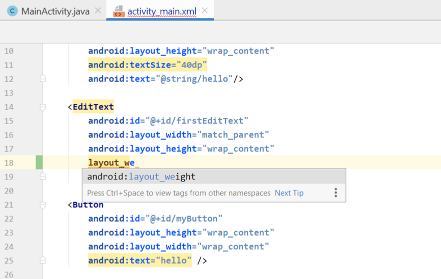
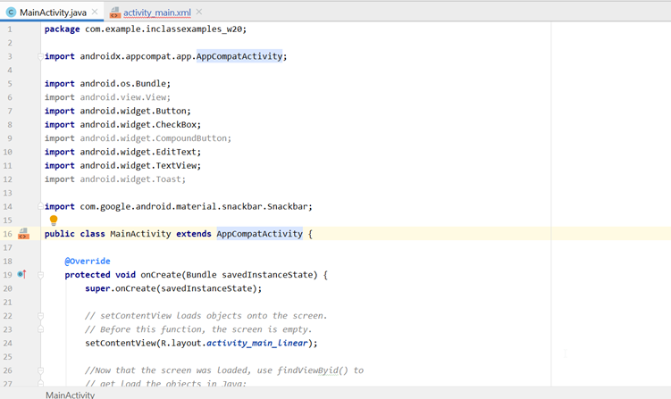

# Module 2: Layouts and Widgets

## Introduction

- Layouts define the structure of a user interface in an app.
- Built using a hierarchy of `View` and `ViewGroup` objects.
  - **View**: Draws visible and interactive elements.
  - **ViewGroup**: Invisible container organizing Views and other ViewGroups.
- **Widgets**: At-a-glance interactive app elements (e.g., Buttons, TextViews) that users can move/resize on their home screen.

This module focuses on:
- Creating GUI elements (widgets)
- Positioning them using various layouts
- Programming widget behavior with Java

---

## Learning Outcomes

By the end of this module, you should be able to:
- Implement layouts: `LinearLayout`, `GridLayout`, `RelativeLayout`
- Create widgets: `Button`, `ImageButton`, `TextView`, `EditText`, `ListView`, `Spinner`, `Checkbox`, `RadioButton`, `Switch`
- Use popups: `Toast`, `Snackbar`
- Use XML and Android namespaces
- Write and use Lambda functions
- Connect XML widgets to Java using `findViewById()`

---

## Key Terms and Concepts

### Namespaces
- Define where Android attributes and tags come from.
- Example:  
  `xmlns:android="http://schemas.android.com/apk/res/android"`  
  This allows access to built-in Android XML tags and attributes.

### Layouts
- Describe how UI elements are arranged.
- Built from:
  - **View**: Visible UI components (e.g., TextView, Button)
  - **ViewGroup**: Containers (e.g., LinearLayout, RelativeLayout)

### Widgets
- Interactive UI components (e.g., Buttons, Checkboxes).
- Used to build user interfaces within Android Studio.
- Example: Start a project named “Widgets” and explore widget options in the palette.

### Lambda Functions
- Introduced in Java 8.
- Compact way to define functions for single-method interfaces.
- Useful for cleaner, concise event handling.

### GitHub
- Platform for version control using Git.
- Acquired by Microsoft in 2018.
- Provides tools for collaboration, code hosting, and source control.

## Setup Module

### GitHub Setup

- **Windows**: Open **Git Bash**  
- **Mac/Linux**: Open a **Terminal**

Clone the course repository:

    cd ~/AndroidStudioProjects
    git clone https://github.com/PiyushALG/Algonquin_CST2335_InClassExamples

> ⚠️ Note: The link in the image may be outdated. Use the link above.

- In Android Studio, go to **File > Open** and select the cloned directory.
- Share the project with your **personal GitHub account** to create your own version.

---

## XML Review

- XML is similar to HTML, with key differences:
  - Every opening tag **must have** a closing tag.
  - Tags must be **properly nested**:

        <A> <B> </B> </A>

  - **Self-closing tag** syntax:

        <A /> is equivalent to  (if empty)

  - Tags can include parameters:

        <A param1="value1" param2="value2" />

  - **Case sensitive**:

        <Button> ≠ </button>

- XML does **not have fixed tags** — structure defined by:
  - **XML Schemas**
  - **Document Type Definitions (DTD)**

- Android uses **namespaces** to define tags:
  - Declared in root tag:

        xmlns:android="http://schemas.android.com/apk/res/android"

  - Similar to an **import statement** in Java

## XML Namespaces

### XML Declaration
The first line in an XML file is typically:

    <?xml version="1.0" encoding="utf-8"?>

### Root Tag
The root tag follows the declaration and is often something like:

    <LinearLayout>

Namespaces are declared in this root tag and may include:

    xmlns:android="http://schemas.android.com/apk/res/android"
    xmlns:app="http://schemas.android.com/apk/res-auto"
    xmlns:tools="http://schemas.android.com/tools"

### Purpose of Namespaces

- **android:** Used for standard Android attributes like:

        android:text="Hello"
        android:layout_height="match_parent"

- **app:** Used for backward compatibility and support library attributes.
- **tools:** Used only in the Android Studio editor to preview UI elements. Not included in your final APK.

---

## Learning Activity: XML Namespaces

### Steps:
1. Open `activity_main.xml` in the `InClassExamples` project.
2. Identify the root tag (`<LinearLayout>`).
3. Delete the line:

        xmlns:android="..."

4. Observe that every parameter starting with `android:` turns red.
5. To fix this:
   - On **Windows**, press `Alt + Enter`.
   - On **Mac**, press `Option + Enter`.
   - Android Studio will auto-import the correct namespace.

---

### Notes:
- Removing `tools:` parameters or the namespace declaration will **not break your project**.
- When typing XML attributes, Android Studio will **auto-complete** the correct namespace.  
  For example, typing `layout_weight` will be auto-filled as:

        android:layout_weight

## Android History: Backward Compatibility

- Android was **not originally designed for tablets**.
- When the **iPad** was released, Google rushed to release a competing tablet OS.
- **Android 3.0 (Honeycomb)** was developed **exclusively for tablets** and was **not available on phones**.
- **Android 4.0 (Ice Cream Sandwich)** was the **first version** of Android to support **both phones and tablets**.

### AppCompatActivity

- To bring tablet-only features from newer versions (like Android 3.0+) to older phone versions (like Android 2.0), Android introduced **backward compatibility classes**.
- One of these is `AppCompatActivity`, which extends the basic `Activity` class and adds support features.
- This is why your activity classes typically extend:

    public class MainActivity extends AppCompatActivity

- It allows **new features to work on older devices** through the support libraries.

## Layouts and Widgets

- All **layouts and widgets** in Android must have a `layout_width` and `layout_height`.
- These parameters are defined in the `xmlns:android` namespace.

### layout_width & layout_height

- Two common values:
    - `"match_parent"` – fill the entire space of the parent container
    - `"wrap_content"` – shrink to fit the content

### android:id

- Each widget should have an ID:
  
      android:id="@+id/myId"
  
- IDs in Android are similar to HTML `id` attributes.

### Common Widgets Used in This Course

- `Button`
- `ImageButton`
- `TextView`
- `EditText`
- `Checkbox`
- `Switch`
- `RadioButton`
- `ListView`
- `Spinner`

- All of these widgets **must include**:
    - `layout_width`
    - `layout_height`
    - `android:id`

### Connecting XML to Java

- Define the widget in XML with an ID.
- Access it in Java using:

      Button myButton = findViewById(R.id.myId);

- `findViewById()` returns the Java object that matches the ID from XML.

---

## Text and EditText

### TextView

- `TextView` is a widget that **displays non-editable text** on the screen.
- In XML, use:

      android:text="@string/something"

### EditText

- `EditText` is a widget that **displays editable text**.
- To show default guidance text when the field is empty, use:

      android:hint="@string/hint_text"

### Working with Text in Java

- Set the text of a widget:

      myTextView.setText("Hello");

- Get the current text from an EditText:

      String input = myEditText.getText().toString();

- Get a localized string from your resources:

      String hint = getResources().getString(R.string.hint_text);

### Text Size

- To change the text size, use:

      android:textSize="18sp"

## Button

### XML Configuration

- A button requires text and ID:

      android:text="I'm a button"
      android:id="@+id/button1"

### Java: Accessing the Button

- In `onCreate()` after `setContentView()`:

      Button btn = (Button) findViewById(R.id.button1);

### Setting a Click Listener

- Buttons should respond to user clicks. Use:

      btn.setOnClickListener(OnClickListener obj);

### OnClickListener Interface

- `OnClickListener` is an interface with one method:

      void onClick(View v)

### Example: Anonymous Class Implementation

- You can use an anonymous inner class to handle clicks:

      btn.setOnClickListener(new View.OnClickListener() {
          @Override
          public void onClick(View v) {
              // This code runs when the button is clicked
          }
      });

## Lambda Functions

- Lambda functions allow you to write more concise code when an interface has only one abstract method.
- Instead of writing an anonymous class, you can write just the function body.
- The method name is inferred from the functional interface.

### Example

Instead of writing:

    btn.setOnClickListener(new View.OnClickListener() {
        @Override
        public void onClick(View v) {
            // Handle click
        }
    });

You can write:

    btn.setOnClickListener(v -> {
        // Handle click
    });

### Requirements

- Lambda functions are supported only in Java 1.8 or higher.
- You must configure Android Studio to use Java 1.8.

### How to Set Java 1.8

- Use the **Android** project view.
- Right-click the **app** folder.
- Select **Open Module Settings**.

## Module Settings

To enable Java 1.8 features (such as Lambda functions), configure your module settings:

### Steps

- Open Android Studio.
- In the **Android** project view, right-click the **app** folder.
- Select **Open Module Settings**.

### In the Properties Tab

- Locate the fields:
    - **Source Compatibility**
    - **Target Compatibility**
- Set both to **Java 1.8**.
- Confirm that the **Resolved** value shown to the right reflects Java 1.8.

## ImageButton, CheckBox, Switch, and RadioButton

### ImageButton

- A special kind of button that uses an image instead of text.
- In XML:

    android:src="@drawable/picture_file"

- In Java:

    ImageButton iButton = (ImageButton)findViewById(R.id.buttonId);
    iButton.setOnClickListener(btn -> numClicks++);

---

### CheckBox, Switch, and RadioButton

- All are toggleable buttons (on/off).
- Difference is only in appearance.

- In XML:

    android:checked="true" or "false"

- In Java:

    CheckBox cb = (CheckBox)findViewById(R.id.checkbox);
    cb.setChecked(true);

    // Use a listener to detect changes
    cb.setOnCheckedChangeListener((cb, isChecked) -> {
        // Handle the toggle event here
    });

- Listener interface:

    onCheckedChanged(CompoundButton cb, boolean isChecked)

- Lambda syntax is allowed because it's a single-method interface:

    setOnCheckedChangeListener((cb, isChecked) -> {
        // Your code here
    });

## Toast and Snackbar

### Toast

- Built-in Android notification that briefly shows a message to the user.
- Often used on button clicks or checkbox/switch changes.
- One line of code:

    Toast.makeText(Context, "Message String", int duration).show();

- **Context**: Use `this` (the current `AppCompatActivity`)
- **Duration**: Either `Toast.LENGTH_SHORT` or `Toast.LENGTH_LONG`

---

### Snackbar

- Similar to Toast but slides in from the bottom of the screen.
- One line of code:

    Snackbar.make(View, "Message String", int duration).show();

- **View**: Can be any widget on the screen (e.g., a button or checkbox)
- You can add an optional button to the Snackbar:

    Snackbar.setAction("Button text", clickListener);

- If the user clicks the button, the `onClick()` method of the `clickListener` is invoked.

## Layouts

All layouts require `layout_width` and `layout_height` parameters.

---

### LinearLayout

- Arranges elements one after the other, **horizontally** or **vertically**.
- Uses the `android:orientation` attribute:
    - `horizontal` (default)
    - `vertical`

- Example orientation setting:

    android:orientation="vertical"

- Button height/width effects:
    - If `button2` has `layout_height="match_parent"`, it fills the vertical space and pushes other elements off-screen.
    - If orientation is horizontal and `button1` has `layout_width="match_parent"`, it fills the horizontal space.

- To use LinearLayout example:
    - Load layout in Java:

        setContentView(R.layout.activity_main_linear);

---

### GridLayout

- Defines a grid layout using `columnCount` and `rowCount`.
- Widgets are placed left to right, row by row.

- Example manual placement:

    android:layout_row="2"
    android:layout_column="1"

- You can span multiple rows/columns:

    android:layout_columnSpan="2"
    android:layout_rowSpan="1"

- Column weights:
    - Used to proportionally divide space.
    - Formula:

        item space = my weight / (sum of all weights in column)

---

### RelativeLayout

- Position elements relative to each other or the parent container.

- Examples:

    android:layout_toRightOf="@+id/button1"
    android:layout_below="@+id/button2"
    android:layout_alignParentTop="true"
    android:layout_alignParentEnd="true"

- Similar to building a puzzle — each new element is placed in relation to others.

---

### ConstraintLayout

- Modern replacement for RelativeLayout.
- Use constraints to align elements to parent or other widgets.

- Example alignment to top-right of screen:

    android:layout_constraintRight_toRightOf="parent"
    android:layout_constraintTop_toTopOf="parent"

- You can also constrain elements to other views using their IDs.

---

📌 Refer to `activity_main_linear.xml`, `activity_main_grid.xml`, and `activity_main_relative.xml` for hands-on examples.

## XML and Java

- When you create a **Widget in XML**, you should give it an ID:

    android:id="@+id/myWidget"

- In Java, declare a variable and use `findViewById()` to get a reference to the widget:

    Button myButton = (Button)findViewById(R.id.myWidget);

- **Nested Layouts**:
    - Layouts can be nested inside each other.
    - Example:
        - A `LinearLayout` can contain:
            - a `GridLayout`
            - a `RelativeLayout`

- **Android Studio Tip**:
    - Use the **Component Tree** view in the layout editor to see the full layout hierarchy and nesting stru

## Application Crashes

- Android apps may crash due to **uncaught exceptions**, often `NullPointerException`.
- Common cause: calling `findViewById(R.id.something)` when the ID **does not exist** in the current layout.
- `findViewById()` returns **null** if the widget ID is not found.
- To debug:
    - Set a **breakpoint** at the start of `onCreate()` in your activity.
    - Step through to check which objects are `null`.
- More detailed debugging techniques with breakpoints will be covered in a future module.

