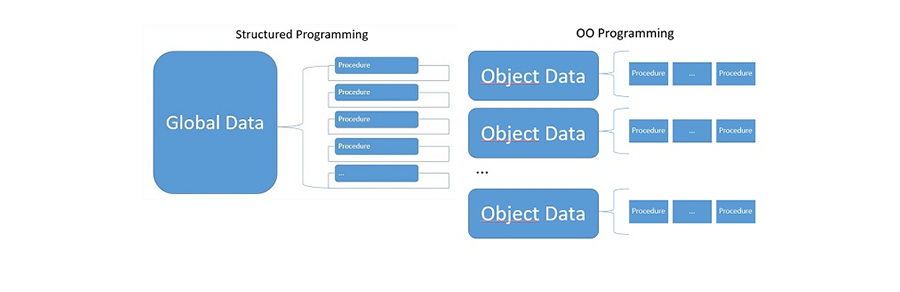
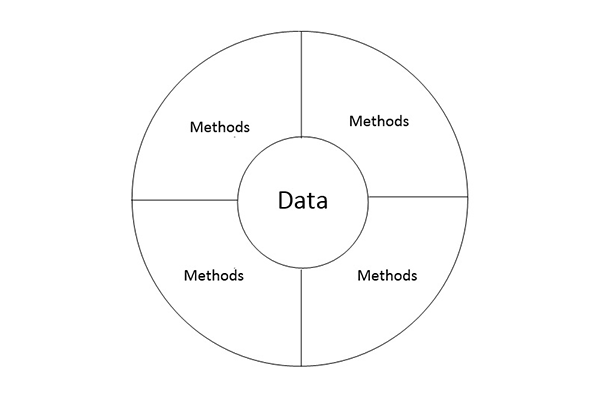
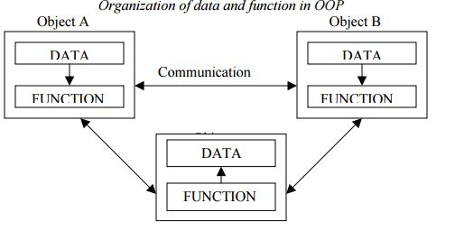
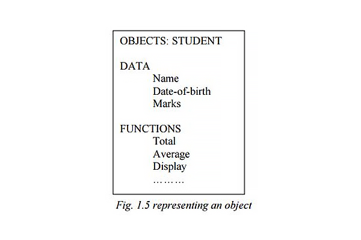
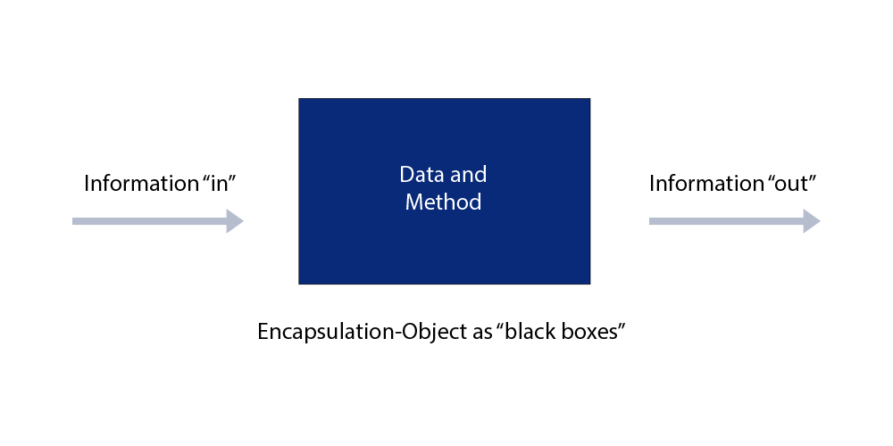
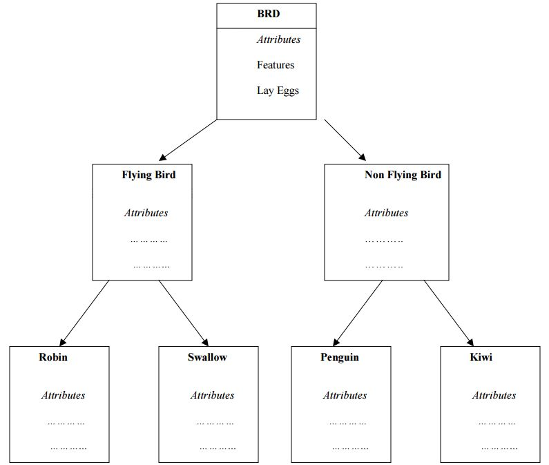
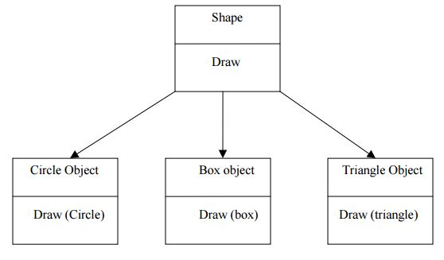
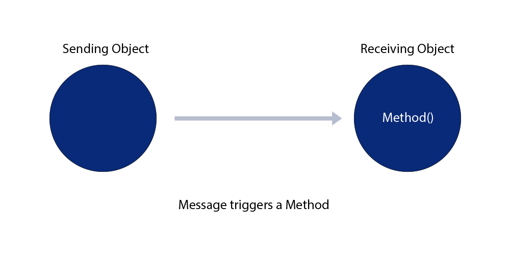
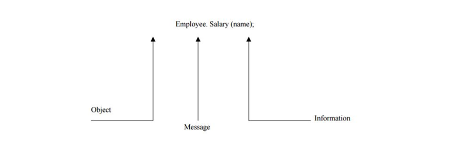

# Module 1: Fundamentals of Object-Oriented Programming

## Introduction
Object-Oriented Programming (OOP) is a modular programming approach that organizes programs by creating partitioned memory areas for both data and functions. These serve as templates for creating copies of modules on demand. OOP integrates structured programming principles with new concepts to overcome limitations of conventional programming.

### Learning Outcomes
By the end of this module, you will be able to:
- Explain conventional, structured, and object-oriented programming concepts.
- Understand key OOP concepts such as Encapsulation, Inheritance, and Polymorphism.
- Discuss benefits and applications of Object-Oriented Programming.

### Key Terms and Concepts

- **Structured Programming:** A precursor to OOP emphasizing top-down design and compositional subsystems for better program clarity and modification.
- **Object-Oriented Paradigm:** A programming model based on "objects" containing data (fields) and code (methods) that interact.
- **Class:** A blueprint that defines the behavior and contents of objects.
- **Object:** A self-contained component with methods and properties that define behavior.
- **Methods:** Procedures associated with a class defining object behavior.
- **Abstraction:** Showing only relevant details, reducing complexity.
- **Encapsulation:** Binding data and functions together, ensuring data safety and hiding.
- **Data Hiding:** Protecting internal object details from outside access.
- **Inheritance and Reusability:** Creating new classes based on existing ones, forming a hierarchy.
- **Polymorphism:** Ability of variables, functions, or objects to take multiple forms.
- **Dynamic Binding:** Linking method calls to code at run-time, enabling flexibility (also called late binding).

## Introduction to Object-Oriented Programming (OOP)

### Constant Change in the Software Industry

- The software industry is constantly evolving.
- New tools and programming approaches emerge frequently.
- These changes raise important issues for software engineers:
  - Maintainability
  - Reusability
  - Portability
  - Security
  - Integrity
  - User-friendliness

### The Need for Better Program Structure

- Complex software systems require more than just sequences of code.
- Developers need reliable construction techniques and understandable program structures.
- These structures must support easy implementation and modification across varied scenarios.

### Early Programming Approaches

- Over time, several methods have been used to manage growing software complexity:
  - Modular Programming
  - Top-down Programming
  - Bottom-up Programming
  - Structured Programming
- These techniques became prominent over the past few decades.

### Rise and Limits of Structured Programming

- Structured programming (e.g., using C) became the dominant paradigm in the 1980s.
- It allowed for the creation of moderately complex programs.
- However, as software systems grew, structured programming struggled with:
  - Scalability
  - Reusability
  - Ease of maintenance
  - Bug reduction

### Introduction to Object-Oriented Programming (OOP)

- OOP addresses the shortcomings of previous paradigms.
- Combines the best of structured programming with new concepts.
- It’s not tied to a specific language — it's a **way of organizing and developing programs**.

### Languages Supporting OOP

- Some languages naturally support OOP principles:
  - Smalltalk
  - Objective-C
  - C++
  - Ada
  - Object Pascal
- **C++**: A procedural language with object-oriented extensions; widely used.
- **Java**: A pure object-oriented language, modern and powerful.
- **C#**: A newer OOP language developed by Microsoft.

## Object-Oriented Paradigm

Object-oriented programming (OOP) is a programming paradigm based on **objects**, which encapsulate both **data** and **methods**. This approach promotes **modularity** and **reusability** in software design.

Objects are usually instances of **classes** and interact with one another to build applications and systems. OOP enables the decomposition of problems into discrete entities called **objects**, with each object bundling its data and behavior.

### Object = Data + Method

### Key Features of Object-Oriented Programming

- **Bottom–up approach** in program design  
- Programs are **organized around objects**, grouped into classes  
- Emphasis on **data**, with methods to operate on the object’s data  
- **Data hiding**: internal data is protected from outside access  
- Objects **interact via methods**  
- **Reusability**: new classes can be created by extending existing ones (inheritance)  

> **Grady Booch** defines OOP as:  
> _“A method of implementation in which programs are organized as cooperative collections of objects, each of which represents an instance of some class, and whose classes are all members of a hierarchy of classes united via inheritance relationships.”_

### Object Model

The **object model** visualizes software elements in terms of objects and their interactions. This module explores the fundamental concepts and terminology used in object-oriented systems.

## Basic Concepts of Object-Oriented Programming (OOP)

It is necessary to understand some of the core concepts used extensively in object-oriented programming. These include:

- Objects  
- Classes  
- Data Abstraction and Encapsulation  
- Inheritance  
- Polymorphism  
- Dynamic Binding  
- Message Passing  

---

## Objects

An **object** is a real-world entity in an object-oriented system that may have physical or conceptual existence. Each object has:

- **Identity** – a unique property distinguishing it from other objects  
- **State** – the current condition or properties (data) of the object  
- **Behaviour** – the actions the object can perform or undergo (methods)

Objects can represent physical things like a `Car` or `Customer`, or abstract entities like `Invoice` or `Project`.

---

## Classes

A **class** is a blueprint for creating objects. It defines:

- A set of **attributes** (data members)
- A set of **operations** or **methods** (functions) that define behavior

**Example:**

    class Fruit {
        String color;
        void displayColor() {
            System.out.println(color);
        }
    }

    Fruit mango = new Fruit();

Classes group related data and functions together, enabling code reuse through instantiation.

> 

---

## Data Abstraction and Encapsulation

**Encapsulation** is the wrapping of data and methods into a single unit (class). The internal state of an object is hidden from the outside world (data hiding), and access is only allowed through methods.

**Abstraction** is the concept of showing only essential features and hiding the background details. It simplifies complexity by modeling relevant data only.

> 

---

## Inheritance

**Inheritance** is the mechanism by which a new class (subclass) acquires the properties and behaviors of an existing class (superclass).

- Supports **code reuse**
- Enables **hierarchical classification**
- Allows extension without modifying existing code

> Example: `Robin → FlyingBird → Bird`

> 

---

## Polymorphism

**Polymorphism** means “many forms.” It allows:

- The same method or operator to behave differently based on context
- **Function overloading**: same function name, different parameters  
- **Operator overloading**: same operator behaves differently depending on operand types

Example:

    System.out.println(2 + 3);       // Integer addition
    System.out.println("2" + "3");   // String concatenation

Polymorphism also supports **interface consistency** across different types.

> 

---

## Dynamic Binding

**Dynamic binding** (late binding) is the process where method calls are resolved at runtime rather than compile time. It is associated with:

- **Polymorphism**
- **Method overriding** in inherited classes

This allows the program to decide which method to invoke at runtime based on the object’s actual class.

---

## Message Passing

Objects **communicate** with one another via **messages**:

1. Create classes
2. Instantiate objects
3. Send and receive messages (method calls)

A message includes:

- The **target object**
- The **method name**
- **Arguments** to pass

Example:

    employee.getSalary();
    student.enroll("Math101");

> 

> 
---

## External Link

See the full lesson here:  
[Chalmers OOP Lecture](http://www.cse.chalmers.se/edu/year/2016/course/TDA547_Object_Oriented_Programming/lect02.html)

## Benefits of Object-Oriented Programming (OOP)

- **Faster Development**  
  Reusable components and modular design accelerate software creation.

- **Easier Maintenance**  
  Individual modules can be fixed or updated without affecting the entire system.

- **Simplified Upgrades**  
  Enhancements and changes can be integrated with minimal disruption.

- **Code Reusability**  
  Objects, designs, and functions can be reused across projects or within the same project.

- **Reduced Integration Risks**  
  Modular architecture makes it easier to integrate and manage complex systems.

## Application of Object-Oriented Programming (OOP)

- OOP is a widely discussed and popular programming paradigm among software engineers.
- It has gained importance in many areas, especially where complex systems need to be simplified.

### Popular Application Areas:

- **User Interface Design**  
  Widely used in windowing systems, menus, and other UI components.

- **Real-Time Systems**

- **Simulation and Modeling**

- **Object-Oriented Databases**

- **Artificial Intelligence (AI) and Expert Systems**

- **Neural Networks and Parallel Programming**

- **Decision Support and Office Automation Systems**

OOP helps manage complexity by organizing software into objects with attributes and methods, making it easier to design and maintain large systems.

## Summary

- Java is an object-oriented language that organizes program code into logical units called objects.
- It leverages key OOP concepts:  
  - **Encapsulation**  
  - **Inheritance**  
  - **Polymorphism**
- This chapter introduced these basic OOP concepts along with the benefits and common applications of the object-oriented approach.
