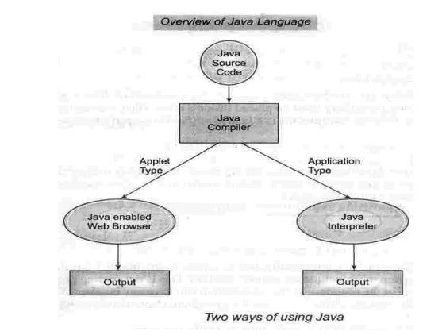
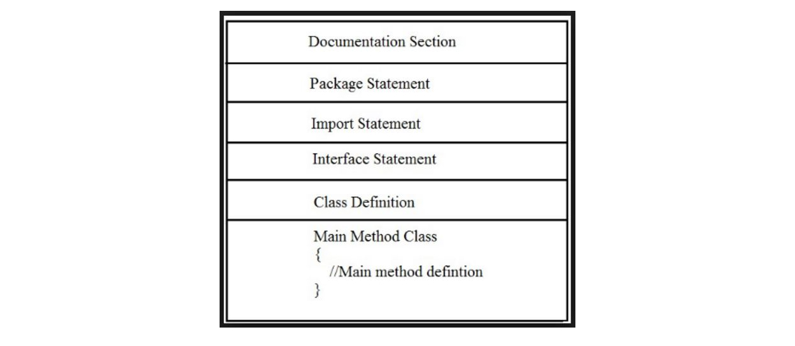

# Module 2: Overview of Java Language

## Introduction
This module builds on the concepts of object-oriented programming covered previously, including objects and classes, and their benefits and applications. Here, we introduce core Java programming concepts, guide you through installing and using the Eclipse IDE, and demonstrate how to write and execute Java programs in Eclipse. We also cover instance methods like Mutator, Accessor, and Constructor with examples, explain the basic structure of Java programs, and show how to generate UML class and object diagrams for problem statements.

### Learning Outcomes
By the end of this module, you should be able to:
- Understand basic features of Java programming.
- Install and run the Eclipse IDE for Java development.
- Compile and execute Java programs with multiple classes in Eclipse.
- Generate UML class and object diagrams using object-oriented techniques.
- Implement instance variables and methods such as Constructor, Mutator, and Accessor.
- Implement non-polymorphic behavior with object methods.

### Key Terms and Concepts

- **Class**: A user-defined blueprint or prototype from which objects are created.
- **Identifier**: Names of variables, methods, classes, packages, and interfaces.
- **main**: The entry point method of any Java program.
- **public**: A keyword declaring that a member is accessible from any other class.
- **static**: Indicates that a member belongs to the class itself, not to instances.
- **void**: Used in method declarations to specify that the method does not return a value.
- **string**: An object representing a sequence of characters.
- **args**: The name of the array parameter passed to `main`; can be any valid identifier.
- **println**: A method that outputs text to the console.
- **double**: A data type for decimal values; not suitable for precise values like currency.
- **Package**: A way to group related classes, sub-packages, and interfaces.
- **Import**: Keyword used to include built-in or user-defined packages for access in the source file.
- **Interface**: Similar to a class but contains only method signatures and fields, without method implementations.
- **Virtual Machine**: The Java Virtual Machine (JVM) executes Java programs.

## Why Learn Java Programming?

- **Java Overview:**  
  Java is a high-level, object-oriented programming language developed by Sun Microsystems in 1995. It runs on multiple platforms like Windows, Mac OS, and UNIX.

- **Java Editions:**  
  Java SE (Standard Edition), Java EE (Enterprise Edition), and Java ME (Micro Edition) cater to different application types such as enterprise and mobile applications.

- **Key Features of Java:**  
  - **Write Once, Run Anywhere:** Java bytecode runs on any platform with a Java Virtual Machine (JVM).  
  - **Object-Oriented:** Everything in Java is an object, making it extensible.  
  - **Platform Independent:** Compiled to platform-neutral bytecode, not machine-specific code.  
  - **Simple:** Designed for ease of learning and mastery.  
  - **Secure:** Supports virus-free and tamper-free systems using public-key encryption.  
  - **Architecture Neutral & Portable:** Runs on many processors without modification.  
  - **Robust:** Emphasizes compile-time and runtime error checking.  
  - **Multithreaded:** Supports concurrent task execution for smooth applications.  
  - **Interpreted:** Bytecode is translated on the fly for rapid development.  
  - **High Performance:** Uses Just-In-Time (JIT) compilers.  
  - **Distributed:** Built for internet and networked environments.  
  - **Dynamic:** Adapts to evolving runtime environments with extensive runtime information.

- **History:**  
  Java started as the ‘Oak’ language by James Gosling in 1991, renamed to Java later. The first public release was Java 1.0 in 1995, promoting the WORA principle. In 2006-2007, Sun Microsystems released Java’s core code as open source under the GPL license.

- **Java Development Environment:**  
  Understanding the Java development lifecycle and tools is important (refer to “Java How to Program” by Deitel and Deitel for detailed phases).

## A Simple Java Program
In this section, we will learn how to write a simple Java code and the meaning of each section of a program.

    public class Hello {

        /* 
        * Author: www.w3schools.in
        * Date: 2018-04-28
        * Description:
        * Writes the words "Hello Java" on the screen 
        */
        public static void main(String[] args) {
            System.out.println("Hello Java");
        }
    }

**Program Output:**

    Hello Java

### Java Program Structure
**Documentation Section**
Comments are beneficial for understanding code. They are optional, but recommended.

**Package Statement**
Group classes together in a package.

    package package_name;

**Import Statements**
Used to include external classes.

    import calc.add;

**Interface Statement**
Like a class, but only contains method signatures. Optional, used for multiple inheritance.

**Class Definition**
Defines objects and behavior in Java.

**Main Method Class**
The `main` method is the entry point of any Java application. There may be many classes, but only one has `main`.

### A Java Application with Two Classes
A real-life application will generally require multiple classes. Here's an example with two classes:

    class Room {
        float length;
        float breadth;

        void getdata(float a, float b) {
            length = a;
            breadth = b;
        }
    }

    class RoomArea {
        public static void main(String[] args) {
            float area;

            Room room1 = new Room();       // Creates an object room1
            room1.getdata(14, 10);         // Assigns values to length and breadth

            area = room1.length * room1.breadth;
            System.out.println("Area = " + area);
        }
    }

**Explanation**
- `Room` defines the dimensions and a method to initialize them.
- RoomArea:
  - Declares a Room object
  - Initializes dimensions using `getdata()`
  - Calculates and prints the area
- Note the use of the dot operator (`.`) to access fields and methods.

## Java Object, Class & Constructor

### Object

Objects have states and behaviours.  
Example: A dog has states – color, name, breed – as well as behaviours – wagging the tail, barking, eating.  
An object is an instance of a class.

---

### Class

A class can be defined as a template/blueprint that describes the behaviour/state that the object of its type supports.

---

### Objects in Java

Let us now look deep into what objects are. If we consider the real world, we can find many objects around us: cars, dogs, humans, etc. All these objects have a state and behaviour.

For example, a dog’s:
- **State**: name, breed, color  
- **Behaviours**: barking, wagging the tail, running

Software objects have similar characteristics:
- A **software object’s state** is stored in **fields**
- **Behaviour** is shown via **methods**

Methods operate on the internal state of an object, and objects communicate via methods.

---

### Classes in Java

A class is a blueprint from which individual objects are created.

**Example:**

    public class Dog {
        String breed;
        int age;
        String color;

        void barking() {
        }

        void hungry() {
        }

        void sleeping() {
        }
    }

A class can contain the following variable types:

#### Local variables
Defined inside methods, constructors or blocks. They are declared and initialized within the method and destroyed once the method completes.

#### Instance variables
Defined within a class but outside any method. Initialized when the class is instantiated and accessible inside any method, constructor, or block of that class.

#### Class variables
Declared within a class, outside any method, with the `static` keyword.

The example methods `barking()`, `hungry()`, and `sleeping()` demonstrate instance methods.

---

### Constructor

A constructor initializes an object when it is created. It:
- Has the **same name** as the class
- Has **no return type**
- Is used to assign initial values to instance variables or perform startup procedures

All classes have constructors by default unless you define your own. Once defined, the default constructor is no longer used.

**Syntax:**

    class ClassName {
        ClassName() {
            // constructor body
        }
    }

Java has two types of constructors:
- **No-argument constructors**
- **Parameterized constructors**

---

### No-argument Constructors

These constructors do not accept parameters and assign **fixed values**.

**Example:**

    public class MyClass {
        int num;

        MyClass() {
            num = 100;
        }
    }

**Usage:**

    public class ConsDemo {
        public static void main(String args[]) {
            MyClass t1 = new MyClass();
            MyClass t2 = new MyClass();
            System.out.println(t1.num + " " + t2.num);
        }
    }

**Output:**

    100 100

---

### Parameterized Constructors

These constructors accept **one or more parameters**. Parameters are added just like in methods.

**Example:**

    // A simple constructor.
    class MyClass {
        int x;

        // Parameterized constructor
        MyClass(int i) {
            x = i;
        }
    }

**Usage:**

    public class ConsDemo {
        public static void main(String args[]) {
            MyClass t1 = new MyClass(10);
            MyClass t2 = new MyClass(20);
            System.out.println(t1.x + " " + t2.x);
        }
    }

**Output:**

    10 20

## Java Accessor & Mutator

In Java, **accessors** are used to get the value of a private field and **mutators** are used to set the value of a private field.  
Accessors are also known as **getters** and mutators are known as **setters**.

If we declare variables as `private`, they cannot be accessed directly from outside the class. To access or update their values, we use **getter and setter methods**.

---

### Accessors

An accessor method is commonly known as a **get method** or simply a **getter**.

- Returns a property of the object
- Declared as `public`
- Follows a naming scheme: starts with `get`
- Returns the value of a private field
- The return type matches the field’s type

**Syntax:**

    public int getNumber() {
        return number;
    }

**Example:**

    public class Employee {
        private int number;

        public int getNumber() {
            return number;
        }

        public void setNumber(int newNumber) {
            number = newNumber;
        }
    }

---

### Mutators

A mutator method is commonly known as a **set method** or simply a **setter**.

- Modifies the internal state of the object (encapsulation)
- Also known as **modifiers**
- Starts with the word `set`
- Declared as `public`
- Has no return type
- Accepts a parameter of the same type as the private field
- Sets the value of the private field

**Syntax:**

    public void setAge(int age) {
        this.age = age;
    }

**Example:**

    public class Cat {
        private int age;

        public int getAge() {
            return this.age;
        }

        public void setAge(int age) {
            this.age = age;
        }
    }

---

### Purpose of Accessors and Mutators

The main purpose of accessors and mutators is to **hide the internal data** of an object (data encapsulation) and **prevent unauthorized access**.

They:
- Provide **controlled access**
- Allow **validation** before setting values
- Help maintain integrity of the object state

---

### Difference Between Accessors and Mutators

| Aspect              | Accessor                  | Mutator                  |
|---------------------|---------------------------|---------------------------|
| Also known as       | Getter                    | Setter                    |
| Returns a value     | Yes                       | No                        |
| Changes field value | No                        | Yes                       |
| Method prefix       | `get`                     | `set`                     |
| Example             | `getPriority()`           | `setPriority()`           |

These methods are commonly used in Java classes, such as the `Thread` class in the `java.lang` package.

## UML Class and Object Diagram

### Class Diagram

A **class diagram** is a static diagram. It represents the **static view** of an application. Class diagrams are not only used for visualizing, describing, and documenting different aspects of a system, but also for constructing executable code of the software application.

A class diagram describes:
- The attributes and operations of a class
- The constraints imposed on the system

Class diagrams are widely used in modeling **object-oriented systems** because they are the only UML diagrams that can be **directly mapped** to object-oriented languages.

Class diagrams show a collection of:
- Classes
- Interfaces
- Associations
- Collaborations
- Constraints

Class diagrams are also known as **structural diagrams**.

---

### Purpose of Class Diagrams

The purpose of a class diagram is to model the **static view** of an application.

- They are the only UML diagrams which can be directly mapped to object-oriented languages.
- They are widely used during the construction phase of software development.

Other UML diagrams, like activity and sequence diagrams, show flow and interaction, while the class diagram focuses on structure.

**Summary of purposes:**
- Analysis and design of the static view of an application
- Describes responsibilities of a system
- Acts as a base for component and deployment diagrams
- Enables forward and reverse engineering

---

### Purpose of Object Diagrams

While class diagrams represent abstract models (classes and their relationships), **object diagrams** represent **instances** of those classes at a specific moment — they are **concrete** and closer to real system behavior.

Object diagrams help capture the **static view** of a system at a given point in time.

**Summary of purposes:**
- Forward and reverse engineering
- Visualize object relationships in a system
- Static view of an interaction
- Understand object behavior and relationships from a practical perspective

---

### How to Draw a Class Diagram and Object Diagram?

> **Note**: Before using *video link1*, go to [Lucidchart](https://www.lucidchart.com/pages/) and sign up for free to create UML diagrams or charts online.

---

### Where to Use Class Diagrams?

Class diagrams are used to model the **static view** of a system. This view describes the **vocabulary** of the system — its classes, relationships, and constraints.

They are considered the foundation for:
- Component diagrams
- Deployment diagrams

They are also used for:
- Visualization
- Construction (forward and reverse engineering)
- Code generation

Though UML diagrams typically aren't mapped directly to code, **class diagrams are the exception** — they map cleanly to object-oriented languages like Java, C++, etc.

**In summary, class diagrams are used for:**
- Describing the static view of the system
- Showing collaboration among static elements
- Describing the system's functionalities
- Constructing software applications in object-oriented languages

---

### Where to Use Object Diagrams?

Object diagrams are like **snapshots** of a running system at a particular time.

**Example**: Imagine a running train.

Taking a snapshot of it would show:
- A specific state (e.g., "running")
- A specific number of passengers (which may change if snapped at a different time)

This snapshot reflects an **object** in a specific state with specific values — this is what an object diagram captures.

**In summary, object diagrams are used for:**
- Creating prototypes of a system
- Reverse engineering
- Modeling complex data structures
- Understanding the system from a practical perspective

## Summary

Java is a general-purpose, object-oriented programming language. This module covered:

- A brief history and basic structure of Java programs  
- Key Java elements and how to write and run a simple application  
- Installing and using Eclipse IDE  
- Concepts of classes, objects, and constructors with examples  
- Accessor (getter) and mutator (setter) methods  
- Basic UML class diagrams to model class relationships
