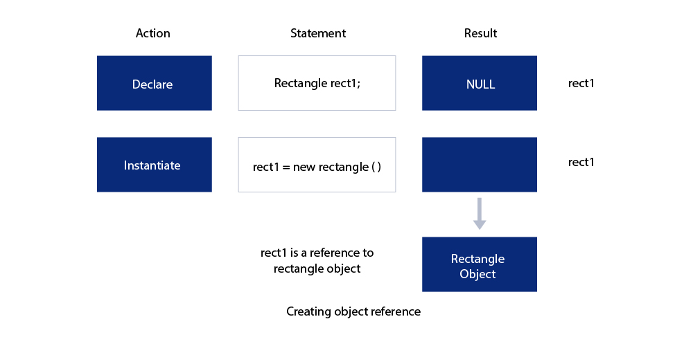
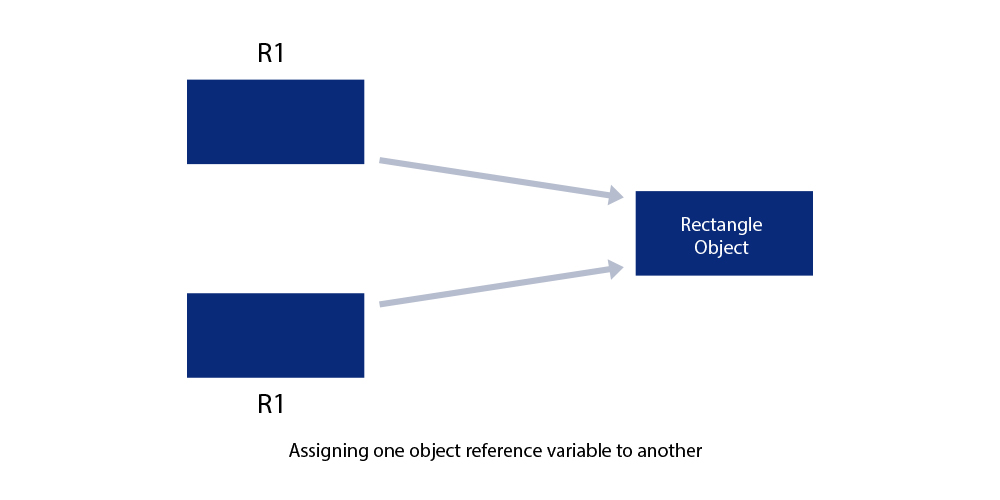

# Module 3: Classes, Objects and Methods

## Introduction

Java is a true object-oriented language and therefore the underlying structure of all Java programs is classes. Anything we wish to represent in a Java program must be encapsulated in a class that defines the state and behaviour of the basic program components known as objects. Classes create objects and objects use methods to communicate between them. That is all about object-oriented programming.

### Learning Outcomes

By the end of this module, you should be able to:

- Explain the concepts of class and object including declaration, definition, and calling structures and use this knowledge for building Java applications.
- Implement the knowledge of method overloading and nesting of methods to create Java programs with desired output in Eclipse.
- Explain the meaning of the word `static` and create a Java program by using this.

### Key Terms and Concepts

Below are a list of terms and concepts that you will come across throughout this module:

- **Classes**  
  A class is a user-defined blueprint or prototype from which objects are created.

- **Objects**  
  Objects are instances of a class.

- **Methods**  
  A method is a block of code which only runs when it is called.

- **Fields**  
  Java fields are the variables inside the class.

- **Instance**  
  Instance variables in Java are used by objects to store their states.

- **Dot Operator**  
  The `.` operator, also known as the member operator, is used to access the member of a package or a class.

- **Overloading**  
  Method overloading is a feature that allows a class to have more than one method having the same name, if their argument lists are different.

- **Static**  
  The `static` keyword in Java means that the variable or function is shared between all instances of that class as it belongs to the type, not the actual objects themselves.

- **Nesting**  
  When a method in Java calls another method in the same class, it is called nesting of methods.

## Defining a Class

A class is a user-defined data type with a template that serves to define its properties. Once the class type has been defined, we can create “variables” of that type using declarations that are similar to the basic type declaration. In Java, these variables are termed as instances of classes, which are actual objects.

The basic form for class definition is:

```java
class classname [extends superclassname]
{
    [ fields declaration; ]
    [ method declaration; ]
}
```

Everything inside the square brackets is optional. Following is a valid class definition:

```java
class Rectangle
{
}
```

Because the body is empty, this class does not contain any properties and therefore cannot do anything. We can, however, compile it and even create objects using it.

> **Note for C++ programmers:**  
> There is no semicolon after the closing brace of the class in Java.

`classname` and `superclassname` are any valid Java identifiers. The keyword `extends` indicates that the properties of the `superclassname` class are extended to the `classname` class. This concept is known as **inheritance**, which will be discussed in a further module.

## Field Declaration

Data is encapsulated in a class by placing data fields inside the body of the class definition. These variables are called **instance variables** because they are created whenever an object of the class is instantiated. We can declare the instance variables exactly the same way as we declare local variables.

```java
class Rectangle
{
    int length;
    int width;
}
```

The class `Rectangle` contains two integer type instance variables. It is allowed to declare them in one line as:

```java
int length, width;
```

> **Note:** These variables are only declared, and therefore no storage space has been created in memory. Instance variables are also known as **member variables**.

## Method Declaration

A class with only fields (and without methods that operate on that data) has no life. The objects created by such a class cannot respond to any messages. We must therefore add methods that are necessary for manipulating the data contained in the class.

Methods are declared inside the body of the class but immediately after the declaration of instance variables. The general form of a method declaration is:

```java
type methodname(parameter-list)
{
    method-body;
}
```

## Creating First Method

Method declarations have four basic parts:

- The name of the method (`methodname`)
- The type of the value the method returns (`type`)
- A list of parameters (`parameter-list`)
- The body of the method

The `type` specifies the type of value the method would return. This could be a simple data type such as `int`, as well as any class type. It could even be `void`, if the method does not return any value.

The `methodname` is a valid identifier. The `parameter-list` is always enclosed in parentheses. This list contains variable names and types of all the values we want to give to method as input. The variables in the list are separated by commas. In the case where no input data is required, the declaration must retain the empty parentheses. Examples include:

```java
int m, float x, float y   // Three parameters
{ }                       // Empty list
```

The body actually describes the operations to be performed on the data. Let's consider the `Rectangle` class again and add a method `getData()` to it.

## Arguments and Parameters in Methods

### Return Keyword in Java Method

The `return` keyword finishes the execution of a method, and can be used to return a value from a method.

`return` is a reserved keyword in Java, i.e., we can’t use it as an identifier. It is used to exit from a method, with or without a value.

`return` can be used with methods in two ways:

### Methods Returning a Value

For methods that define a return type, `return` statement must be immediately followed by a return value.

**Example:**

```java
public class MyClass
{
    static int myMethod(int x)
    {
        return 5 + x;
    }

    public static void main(String[] args)
    {
        System.out.println(myMethod(3));
    }
}
```

**Output:**

```
8
```

### Methods Not Returning a Value

For methods that don’t return a value, `return` statement can be skipped.

**Example:**

```java
public class MyClass
{
    static void myMethod()
    {
        System.out.println("I just got executed!");
    }

    public static void main(String[] args) {
        myMethod();
    }
}
```

**Output:**

```
I just got executed!
```

## Creating an Object

An object in Java is essentially a block of memory that contains space to store all the instance variables. Creating an object is also referred to as **instantiating an object**.

Objects in Java are created using the `new` operator. The `new` operator creates an object of the specified class and returns a reference to that object.

Here is an example of creating an object of type `Rectangle`:

```java
Rectangle rect1;             // declare the object
rect1 = new Rectangle();     // instantiate the object
```

The first statement declares a variable to hold the object reference and the second one actually assigns the object reference to the variable. The variable `rect1` is now an object of the `Rectangle` class.



### Creating Object References

Both statements can be combined into one, as shown below:

```java
Rectangle rect1 = new Rectangle();
```

The method `Rectangle()` is the **default constructor** of the class. We can create any number of objects of `Rectangle`. Example:

```java
Rectangle rect1 = new Rectangle();
Rectangle rect2 = new Rectangle();
```

And so on.

### Introducing Objects

It is important to understand that **each object has its own copy** of the instance variables of its class. This means that any changes to the variables of one object have no effect on the variables of another.



It is also possible to create two or more references to the same object:

```java
Rectangle R1 = new Rectangle();
Rectangle R2 = R1;
```

### Assigning One Object Reference Variable to Another

In this example, both `R1` and `R2` refer to the **same object**.

## Accessing Class Members

Objects contain their own set of variables; we should assign values to these variables in order to use them in our program. Remember, **all variables must be assigned values before they are used**.

Since we are outside the class, we cannot access the instance variables and methods directly. To do this, we must use the concerned object and the **dot operator** as shown below:

```java
objectname.variablename = value;
objectname.methodname(parameter-list);
```

- `objectname` is the name of the object.
- `variablename` is the name of the instance variable inside the object that we wish to access.
- `methodname` is the method that we wish to call.
- `parameter-list` is a comma-separated list of actual values (or expressions) that must **match in type and number** with the parameter list of the method declared in the class.

## Method Overloading

**Method Overloading** is a feature that allows a class to have more than one method with the **same name**, as long as their **argument lists are different**. It is similar to constructor overloading in Java, which allows a class to have multiple constructors with different parameters.

### Example

In the example below, the class `Sample` has two `add()` methods:

- One accepts **two integers**
- The other accepts **three integers**

Java determines which method to execute based on the **number and type of arguments** passed.

```java
public class Sample {

    public static void add(int a, int b) {
        System.out.println(a + b);
    }

    public static void add(int a, int b, int c) {
        System.out.println(a + b + c);
    }

    public static void main(String args[]) {
        Sample obj = new Sample();

        obj.add(20, 40);        // Calls method with 2 parameters
        obj.add(40, 50, 60);    // Calls method with 3 parameters
    }
}
```

### Output

```
60
150
```

This demonstrates how **method overloading** works in Java by selecting the correct method based on the arguments provided.

## Nesting of Methods

Normally, a method of a class can only be called by an object of that class using the **dot operator**. However, there is an exception:

> A method can call another method of the **same class** by simply using its name—**without using the dot operator**.  
This is called **nesting of methods**.

---

### Example

```java
class Nesting {

    int m, n;

    Nesting(int x, int y) {
        m = x;
        n = y;
    }

    int largest() {
        if (m >= n)
            return m;
        else
            return n;
    }

    void display() {
        int large = largest();  // Nested method call
        System.out.println("Largest value = " + large);
    }
}

class NestingTest {

    public static void main(String args[]) {
        Nesting nest = new Nesting(50, 40);
        nest.display();  // Corrected typo in method name
    }
}
```

---

### Output

```
Largest value = 50
```

---

### Notes

- In this example, the method `display()` **calls** the method `largest()` without using the object name—this is **method nesting**.
- A method can call **any number** of other methods in the same class.
- It is also possible for a called method to **call another method**, forming a chain (e.g., `method1()` calls `method2()`, which calls `method3()`, etc.).

## Summary

Classes, objects and methods are the basic components used in Java programming. The concept of **classes** is at the root of Java’s design. We have discussed the following concepts in this module:

- How to define a class  
- How to create objects  
- How to add methods to a class  
- How to write application programs  

The concepts discussed here provide the basics for writing not only **standalone application programs** but also **applets** for use on the Internet.
