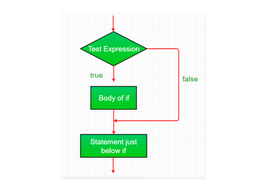
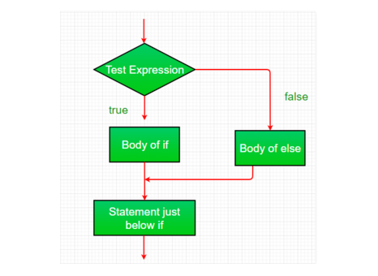
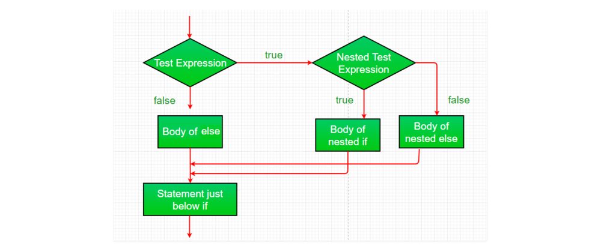
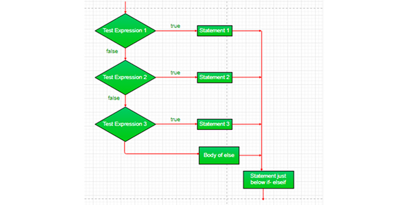
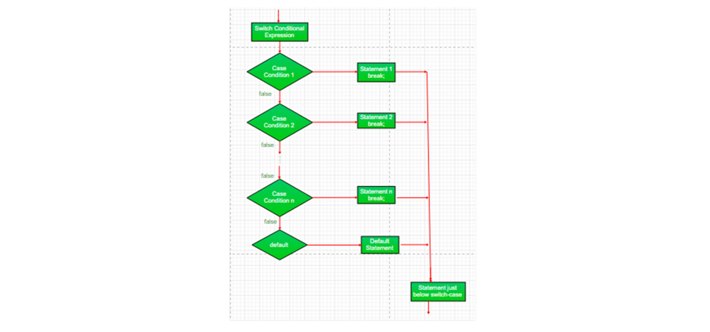
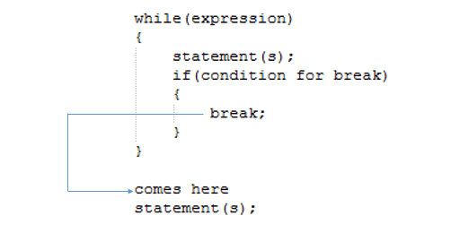
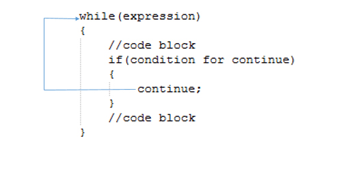

# Module 4: Control Structures in JAVA

## Introduction

Decision making in programming is similar to decision making in real life. In programming we also face some situations where we want a certain block of code to be executed when some condition is fulfilled. A programming language uses control statements to control the flow of execution of a program based on certain conditions. These are used to cause the flow of execution to advance and branch out based on changes to the state of a program.

### Learning Outcomes

By the end of this module, you should be able to:

- Explain the concept of Entry Control and Exit Control loops in Java.  
- Explain the concept about looping structures in Java.  
- Execute Java statements for branching structures.

### Key Terms and Concepts

Below are a list of terms and concepts that you will come across throughout this module:

- **Looping**  
  Looping in programming languages is a feature which facilitates the execution of a set of instructions/functions repeatedly while some condition evaluates to true.

- **Infinite Loop**  
  It is a set of code that would repeat itself forever, unless the system crashes.

- **Entry-control loop**  
  In Entry-Control Loop, condition is evaluated at the beginning of the loop.

- **Exit-control loop**  
  In Exit-Control Loop, condition is evaluated at the end of the loop.

- **Nesting loop**  
  If one loop is defined inside another loop, it is called a nesting loop.

- **Continue**  
  It causes the loop to immediately jump to the next iteration of the loop.

- **Break**  
  It breaks the current flow of the program at the specified condition.

## Decision Making Statements in Java

### Simple `if` Statement

```java
if (condition) {
    // executes if condition is true
}
```



**Example:**
```java
class IfTest {
    public static void main(String args[]) {
        int x = 5;
        if (x > 10)
            System.out.println("Inside If");
        System.out.println("After if statement");
    }
}
```

**Output:**
```
After if statement
```

---

### `if-else` Statement

```java
if (condition) {
    // if block
} else {
    // else block
}
```



**Example:**
```java
class IfElseTest {
    public static void main(String args[]) {
        int x = 9;
        if (x > 10)
            System.out.println("i is greater than 10");
        else
            System.out.println("i is less than 10");
        System.out.println("After if else statement");
    }
}
```

**Output:**
```
i is less than 10
After if else statement
```

---

### Nested `if` Statement

```java
if (condition1) {
    if (condition2) {
        // inner if block
    } else {
        // inner else block
    }
}
```



**Example:**
```java
class NestedIfTest {
    public static void main(String args[]) {
        int x = 25;
        if (x > 10) {
            if (x % 2 == 0)
                System.out.println("i is greater than 10 and even number");
            else
                System.out.println("i is greater than 10 and odd number");
        } else {
            System.out.println("i is less than 10");
        }
        System.out.println("After nested if statement");
    }
}
```

**Output:**
```
i is greater than 10 and odd number
After nested if statement
```

---

### `if...else if...else` Statement

```java
if (condition1) {
    // block 1
} else if (condition2) {
    // block 2
} else {
    // default block
}
```



**Example:**
```java
class IfElseIfTest {
    public static void main(String args[]) {
        int x = 2;
        if (x > 10) {
            System.out.println("i is greater than 10");
        } else if (x < 10) {
            System.out.println("i is less than 10");
        } else {
            System.out.println("i is 10");
        }
        System.out.println("After if else if ladder statement");
    }
}
```

**Output:**
```
i is less than 10
After if else if ladder statement
```

---

### `switch` Statement

```java
switch(expression) {
    case value1:
        // code block
        break;
    case value2:
        // code block
        break;
    default:
        // default block
}
```



**Example:**
```java
public class MyClass {
    public static void main(String[] args) {
        int day = 4;
        switch (day) {
            case 1:
                System.out.println("Monday"); break;
            case 2:
                System.out.println("Tuesday"); break;
            case 3:
                System.out.println("Wednesday"); break;
            case 4:
                System.out.println("Thursday"); break;
            case 5:
                System.out.println("Friday"); break;
            case 6:
                System.out.println("Saturday"); break;
            case 7:
                System.out.println("Sunday"); break;
        }
    }
}
```

**Output:**
```
Thursday
```

## Branching Statements in Java

Java supports **three branching (jump) statements**:

- `break`
- `continue`
- `return`

These statements are used to alter the normal flow of control by **transferring execution** to a different part of the program.

---

### `break` Statement in Java

- **Purpose**: Used to exit loops (`for`, `while`, `do-while`) or `switch` blocks prematurely.
- **Effect**: Control immediately jumps to the statement following the loop or switch.

**Syntax**:
```java
break;
```



**Example (in a `while` loop)**:
```java
class TestClass {
    public static void main (String[] args) {
        int cnt = 1;
        while (cnt <= 5) {
            if (cnt == 3)
                break;
            System.out.println("The value of cnt is: " + cnt);
            cnt = cnt + 1;
        }
        System.out.println("The value of cnt is: " + cnt);
    }
}
```

**Output**:
```
The value of cnt is: 1
The value of cnt is: 2
The value of cnt is: 3
```

**Example (in a `for` loop)**:
```java
class TestClass {
    public static void main (String[] args) {
        int cnt;
        for (cnt = 1; cnt <= 5; cnt++) {
            if (cnt == 2)
                break;
            System.out.println("Current value of cnt is: " + cnt);
        }
        System.out.println("Current value of cnt is: " + cnt);
    }
}
```

**Output**:
```
Current value of cnt is: 1
Current value of cnt is: 2
```

---

### `continue` Statement in Java

- **Purpose**: Skips the **rest of the current iteration** and jumps to the next loop cycle.
- **Effect**: Used inside loops (`for`, `while`, `do-while`) to skip selected iterations.

**Syntax**:
```java
continue;
```



**Example (in a `while` loop)**:
```java
class TestClass {
    public static void main (String[] args) {
        int cnt = 0;
        while (cnt < 5) {
            cnt = cnt + 1;
            if (cnt == 3)
                continue;
            System.out.println("The value of cnt is: " + cnt);
        }
    }
}
```

**Output**:
```
The value of cnt is: 1
The value of cnt is: 2
The value of cnt is: 4
The value of cnt is: 5
```

**Example (in a `for` loop)**:
```java
class TestClass {
    public static void main (String[] args) {
        int cnt;
        for (cnt = 1; cnt < 5; cnt++) {
            if (cnt == 3)
                continue;
            System.out.println("Current value of cnt is: " + cnt);
        }
        System.out.println("Current value of cnt is: " + cnt);
    }
}
```

**Output**:
```
Current value of cnt is: 1
Current value of cnt is: 2
Current value of cnt is: 4
Current value of cnt is: 5
```

---

### `return` Statement in Java

- **Purpose**: Exits from a method and optionally returns a value to the caller.
- **Effect**: All statements after the `return` are bypassed.

**Syntax**:
```java
return;            // for methods with void return type
return expression; // for methods returning a value
```

**Example**:
```java
class Return {
    public static void main(String args[]) {
        boolean t = true;
        System.out.println("Before the return.");
        if (t)
            return;
        System.out.println("This won't execute.");
    }
}
```

**Output**:
```
Before the return.
```

---

## Summary

Loops and conditional statements form the **backbone of programming logic**. In this module, you have explored the key control structures in Java that allow a program to **make decisions** and **repeat tasks** efficiently.

### Loop Structures

You learned about the following loop types:

- **`while` loop** – checks the condition before each iteration (entry-controlled).
- **`do-while` loop** – checks the condition after executing the loop body (exit-controlled).
- **`for` loop** – combines initialization, condition-checking, and increment in a single line.

These looping structures help you write **concise**, **compact**, and **structured programs**.

### Branching Statements

You also learned about the following **branching (jump) statements**:

- **`break`** – terminates the loop or switch immediately.
- **`continue`** – skips the current iteration and continues with the next one.
- **`return`** – exits from a method and optionally returns a value.

These statements provide **fine control** over the flow of execution and can be used to **optimize logic**, **handle special cases**, or **improve code readability**.

---

With these control structures, you are now better equipped to write dynamic, responsive, and logically structured Java programs.
