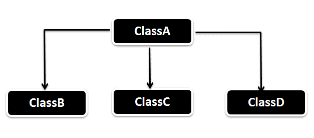

# Module 5: Inheritance and Interfaces

## Introduction

In software development, **reusing existing code** is both efficient and powerful. Java supports this through the concept of **inheritance**, which allows one class to acquire the properties and behaviors of another. Instead of building new classes from scratch, Java developers can **extend** existing classes or **implement** shared behaviors using **interfaces**.

---

### Learning Outcomes

By the end of this module, you should be able to:

- Explain the concept of **inheritance** and its **types** with examples.
- Write and run Java programs for different types of inheritance using **Eclipse IDE**.
- Understand and implement the concept of an **interface**.
- Apply concepts of **multiple inheritance** and **method overriding**.

---

#### Key Terms and Concepts

### Level 1: Inheritance
The mechanism of deriving a **new class** (subclass) from an **existing class** (superclass). It supports **code reuse** and promotes **hierarchical classification**.

### Level 2: Superclass
A **parent/base class** that contains common attributes and methods which are inherited by other classes.

### Level 2: Subclass
A **child/derived class** that inherits attributes and methods from the superclass and may have additional functionality.

### Level 3: Overriding
When a **subclass provides a specific implementation** of a method already defined in its superclass. This supports **runtime polymorphism**.

### Level 3: Static
A **keyword** used to declare class-level methods and variables that **do not require an instance** of the class to be accessed.

### Level 3: Final
A **modifier** used to prevent further modification:
- `final` **class**: cannot be subclassed.
- `final` **method**: cannot be overridden.
- `final` **variable**: becomes a constant.

### Level 3: Interface
An **interface** is like a **contract** in Java. It defines a set of **abstract methods** that implementing classes must provide. Interfaces are used to achieve **abstraction** and **multiple inheritance**.

### Level 4: Multiple Inheritance
Java does not support multiple inheritance through classes but **does support it using interfaces**. A class can **implement multiple interfaces**, inheriting behavior from all of them.

---

## Introduction to Base Class (Super Class or Parent Class) and Derived Class (Sub Class or Child Class)

### Inheritance and Reusability

**Inheritance** supports the concept of **reusability**. When we want to create a new class that shares functionality with an existing one, we can derive the new class from the existing class.  
This allows us to **reuse the fields and methods** of the existing class, minimizing duplication and promoting maintainable code.

---

### Super Class (Base Class / Parent Class)

The class **whose features are inherited** is known as the **Super Class**.

- It contains **common properties and methods** that can be reused by derived classes.
- A superclass is often **more general**, and it serves as a base for extension.

**Example:**

```java
class Animal {
    void eat() {
        System.out.println("This animal eats food.");
    }
}
```

---

### Sub Class (Derived Class / Child Class)

The class **that inherits another class** is known as the **Sub Class**.

- A subclass can **access the inherited members** of the superclass.
- It can also **define its own members** to add specialized behavior.

**Example:**

```java
class Dog extends Animal {
    void bark() {
        System.out.println("The dog barks.");
    }
}
```

**Usage:**

```java
public class TestInheritance {
    public static void main(String[] args) {
        Dog myDog = new Dog();
        myDog.eat();   // inherited method
        myDog.bark();  // subclass method
    }
}
```

**Output:**
```
This animal eats food.
The dog barks.
```

---

## Types of Inheritance in Java

**Inheritance** allows subclasses to inherit all variables and methods from their parent (super) classes. This promotes code reusability and forms a natural class hierarchy.

### Common Types of Inheritance

1. **Single Inheritance**  
   A subclass inherits from a single superclass.
   
   > Example: `Class B extends A`

2. **Multilevel Inheritance**  
   A subclass is derived from a class that is already a subclass.

   > Example: `Class C extends B`, and `Class B extends A`

3. **Hierarchical Inheritance**  
   Multiple subclasses inherit from a single superclass.

   > Example: `Class B extends A`, `Class C extends A`

> ⚠️ Java does **not support multiple inheritance** with classes to avoid ambiguity (e.g., the Diamond Problem). However, it **can** be achieved using **interfaces**.

---

### Defining a Subclass

A subclass is defined using the `extends` keyword:

```java
class SubclassName extends SuperclassName {
    // Variable declarations
    // Method declarations
}
```

- **Superclass**: The existing class whose features are inherited.
- **Subclass**: The new class that inherits features from the superclass.
- The subclass:
  - Inherits all accessible fields and methods from the superclass.
  - Can define its own additional fields and methods.
  - Can override superclass methods to change or extend their behavior.

> 💡 This approach allows you to **add new features** to an existing class **without modifying** its original code.

## Single Inheritance in Java

As the name suggests, **single inheritance** involves one subclass extending a single superclass. This is the most basic form of inheritance in Java.


### Syntax

```java
class Parent {
    // Fields and methods
}

class Child extends Parent {
    // Inherits fields and methods from Parent
    // Can define additional features
}
```

In this setup:
- `Parent` is the **superclass** (also called the base or parent class).
- `Child` is the **subclass** (also called the derived class or child class).
- The subclass gains access to all **non-private** fields and methods of the superclass.

---

### Example: Single Inheritance

```java
class Calculator {
    int add(int a, int b) {
        return a + b;
    }

    int sub(int a, int b) {
        return a - b;
    }
}

public class AdvancedCalculator extends Calculator {
    int mult(int a, int b) {
        return a * b;
    }

    int div(int a, int b) {
        return a / b;
    }

    public static void main(String args[]) {
        AdvancedCalculator cal = new AdvancedCalculator();

        System.out.println(cal.add(1, 2));   // Output: 3
        System.out.println(cal.sub(1, 2));   // Output: -1
        System.out.println(cal.mult(1, 2));  // Output: 2
        System.out.println(cal.div(1, 2));   // Output: 0
    }
}
```

> 🔧 **Note:** Corrected the typo in `main(Strng args[])` to `main(String args[])`.

### Explanation

- The `AdvancedCalculator` class **inherits** the `add` and `sub` methods from the `Calculator` class.
- It **adds** its own methods: `mult` and `div`.
- This demonstrates code **reusability** and **extension of functionality** using inheritance.

### Output

```
3
-1
2
0
```

> ✅ With single inheritance, you reduce duplication and build more maintainable code by extending existing classes.

## Multilevel Inheritance in Java

In Java, **multilevel inheritance** occurs when a class inherits from a class that itself inherits from another class. This forms a **chain of inheritance**.


### Key Characteristics

- Each class has **one parent**, and the inheritance continues down multiple levels.
- **Minimum of three classes** are involved.
- Enables **code reusability** across multiple levels of a hierarchy.
- When an object of the most derived class is created, constructors of all parent classes are called **in the order of inheritance**.

---

### Syntax

```java
class A {
    // Superclass
}

class B extends A {
    // Intermediate class
}

class C extends B {
    // Subclass (inherits from both A and B)
}
```

---

### Example: Multilevel Inheritance

```java
class Animal {
    void eat() {
        System.out.println("eating...");
    }
}

class Dog extends Animal {
    void bark() {
        System.out.println("barking...");
    }
}

class BabyDog extends Dog {
    void weep() {
        System.out.println("weeping...");
    }
}

public class TestInheritance2 {
    public static void main(String args[]) {
        BabyDog d = new BabyDog();
        d.weep();   // Child class method
        d.bark();   // Parent class method
        d.eat();    // Grandparent class method
    }
}
```

---

### Output

```
weeping...
barking...
eating...
```

---

### Explanation

- `Animal` is the **base class** that provides a general behavior (`eat`).
- `Dog` extends `Animal` and adds more specific behavior (`bark`).
- `BabyDog` extends `Dog` and adds even more specific behavior (`weep`).
- The object `d` of class `BabyDog` can access all methods defined in `BabyDog`, `Dog`, and `Animal`.

> 🧠 **Note:** This form of inheritance supports clean hierarchical modeling of real-world relationships.

## Hierarchical Inheritance in Java

In **hierarchical inheritance**, multiple subclasses inherit from a **single superclass**. This means that one parent class is extended by **two or more child classes**.



### Key Characteristics

- Promotes **code reusability**.
- Allows different child classes to **share common behavior** from the same parent class.
- Each subclass can define its **own specific behavior**, in addition to the inherited methods.

---

### Diagram Representation

```
        A
      /   \
     B     C
```

- Class `A` is the superclass.
- Classes `B` and `C` are subclasses that extend `A`.

---

### Syntax

```java
class A {
    public void methodA() {
        // Common behavior
    }
}

class B extends A {
    public void methodB() {
        // Specific to B
    }
}

class C extends A {
    public void methodC() {
        // Specific to C
    }
}
```

---

### Example: Hierarchical Inheritance

```java
class HierarchicalInheritance {
    void displayA() {
        System.out.println("This is content of the parent class");
    }
}

class A extends HierarchicalInheritance {
    void displayB() {
        System.out.println("This is content of child class 1");
    }
}

class B extends HierarchicalInheritance {
    void displayC() {
        System.out.println("This is content of child class 2");
    }
}

public class HierarchicalInheritanceMain {
    public static void main(String args[]) {
        System.out.println("Calling for child class B:");
        B b = new B();
        b.displayA();   // from parent
        b.displayC();   // from child B

        System.out.println("\nCalling for child class A:");
        A a = new A();
        a.displayA();   // from parent
        a.displayB();   // from child A
    }
}
```

---

### Output

```
Calling for child class B:
This is content of the parent class
This is content of child class 2

Calling for child class A:
This is content of the parent class
This is content of child class 1
```

---

### Summary

Hierarchical inheritance is useful when you want to define common functionality in one superclass and extend it differently across multiple specialized subclasses. This keeps code **clean**, **modular**, and **maintainable**.

## Multiple Inheritance in Java

### What is Multiple Inheritance?

In **Object-Oriented Programming (OOP)**, **multiple inheritance** refers to a feature where a class can inherit properties and behavior from **more than one superclass**. In simple terms, a subclass would be able to **extend** multiple parent classes.

---

### Why Java Doesn’t Support It Directly

Java **does not support multiple inheritance with classes** to avoid **ambiguity** and **complexity** — especially the _diamond problem_, where the compiler cannot decide which superclass method to inherit if both define the same method.

Example of the problem (not allowed in Java):

```java
class A {
    void show() {
        System.out.println("Class A");
    }
}

class B {
    void show() {
        System.out.println("Class B");
    }
}

// This would not compile in Java:
class C extends A, B {
    // Error: multiple inheritance not supported
}
```

---

### How Java Supports Multiple Inheritance: **Interfaces**

Although Java doesn’t allow a class to extend more than one class, it **does allow** a class to **implement multiple interfaces**. This provides a way to achieve **multiple inheritance of type**.

We'll explore how this works in the upcoming **Interface** section.

---

### Summary

- **Multiple inheritance** allows one class to inherit from multiple classes.
- Java **does not allow** this with classes to avoid ambiguity.
- Java **supports multiple inheritance via interfaces**, which will be discussed next.

## Hybrid Inheritance in Java

### What is Hybrid Inheritance?

Hybrid inheritance is a combination of **single**, **multilevel**, and **multiple inheritance**. It allows a class to inherit features from multiple classes in different ways.

In Java, **hybrid inheritance cannot be implemented using only classes** because Java **does not support multiple inheritance with classes** (e.g., `class A extends B, C` is invalid).

However, **Java supports hybrid inheritance using interfaces**, which do allow multiple inheritance.


---

### Example of Hybrid Inheritance Using Interfaces

In this example:
- `interface B` and `interface C` both extend `interface A`.
- `class HybridInheritance` implements both interfaces `B` and `C`.

    interface A {
        public void methodA();
    }

    interface B extends A {
        public void methodB();
    }

    interface C extends A {
        public void methodC();
    }

    class HybridInheritance implements B, C {
        public void methodA() {
            System.out.println("Calling methodA");
        }

        public void methodB() {
            System.out.println("Calling methodB");
        }

        public void methodC() {
            System.out.println("Calling methodC");
        }

        public static void main(String args[]) {
            HybridInheritance obj = new HybridInheritance();
            obj.methodA();
            obj.methodB();
            obj.methodC();
        }
    }

---

### Output

    Calling methodA  
    Calling methodB  
    Calling methodC

---

### Key Points

- Hybrid inheritance combines multiple inheritance models.
- Java does not support multiple inheritance through classes to avoid ambiguity (diamond problem).
- Interfaces provide a way to safely implement hybrid inheritance.
- A class can implement multiple interfaces, and those interfaces can extend other interfaces.

✅ **Use interfaces to implement hybrid inheritance effectively in Java.**

## Method Overriding in Java

### What is Method Overriding?

If a subclass (child class) has a method with the same name and parameters as one in its superclass (parent class), it is said to **override** that method. In other words, the child class provides a specific implementation of a method already defined in the parent class.

### Usage of Java Method Overriding

- Provides specific behavior to a method defined in the parent class.
- Enables **runtime polymorphism**, allowing dynamic method resolution.

### Rules for Method Overriding

- The method must have the **same name** as in the parent class.
- The method must have the **same parameters** (method signature).
- There must be an **IS-A relationship** (inheritance between classes).

### Example

    class Animal {
        void sound() {
            System.out.println("Animal makes a sound");
        }
    }

    class Dog extends Animal {
        @Override
        void sound() {
            System.out.println("Dog barks");
        }
    }

    public class TestOverride {
        public static void main(String[] args) {
            Animal a = new Dog();  // upcasting
            a.sound();             // Calls Dog's overridden method
        }
    }

### Output

    Dog barks

### Key Points

- The `@Override` annotation is optional but recommended—it helps catch errors at compile-time if the method signatures don’t match.
- Method overriding is used heavily in frameworks and when building extensible code.
- Only **inherited methods** can be overridden, not constructors or static methods.

## Interfaces: Multiple Inheritance

### What is a Java Interface?

An interface in Java is a blueprint of a class. It contains:
- Abstract methods (methods without a body)
- Constants (static final fields)

Interfaces provide:
- **Abstraction** (hiding implementation details)
- **Multiple inheritance** (since classes cannot extend more than one class)

### Why Use Interfaces?

- To achieve **abstraction**
- To support **multiple inheritance**
- To enable **loose coupling**

### Syntax

    interface InterfaceName {
        // constants
        // abstract methods
    }

    // Example:
    interface Printable {
        void print();
    }

    class A6 implements Printable {
        public void print() {
            System.out.println("Hello");
        }

        public static void main(String args[]) {
            A6 obj = new A6();
            obj.print();
        }
    }

#### Output:

    Hello

### Extending Interfaces

Interfaces can extend other interfaces using the `extends` keyword.

    interface ItemConstants {
        int code = 1001;
        String name = "Fan";
    }

    interface Item extends ItemConstants {
        void display();
    }

- You can also extend multiple interfaces:

    interface ItemMethods {
        void display();
    }

    interface Item extends ItemConstants, ItemMethods {
        // no need to define methods, just combine
    }

> Important: Interfaces cannot extend classes.

### Implementing Interfaces

A class uses the `implements` keyword to use an interface:

    class ClassName implements InterfaceName {
        // implement all methods from InterfaceName
    }

A class can extend another class and implement multiple interfaces:

    class MyClass extends SuperClass implements Interface1, Interface2 {
        // implementation
    }

### Multiple Inheritance via Interfaces

Interfaces allow a class to inherit behavior from multiple sources. This is not possible with classes due to Java's single inheritance model.

#### Example:

    interface AnimalEat {
        void eat();
    }

    interface AnimalTravel {
        void travel();
    }

    class Animal implements AnimalEat, AnimalTravel {
        public void eat() {
            System.out.println("Animal is eating");
        }

        public void travel() {
            System.out.println("Animal is travelling");
        }
    }

    public class Demo {
        public static void main(String args[]) {
            Animal a = new Animal();
            a.eat();
            a.travel();
        }
    }

#### Output:

    Animal is eating
    Animal is travelling

### Summary

- Java interfaces support abstraction and multiple inheritance.
- All interface fields are `public static final`.
- All methods are implicitly `public abstract`.
- A class can implement multiple interfaces.
- Interfaces can extend multiple interfaces, but cannot extend classes.
- The implementing class must define all abstract methods.

## Summary

In this module, we have explored the detailed concepts of **inheritance** and its various **types** in Java. We covered:

- The **syntax** for creating superclasses and subclasses.
- How inheritance promotes **code reusability**.
- Types of inheritance:
    - Single Inheritance
    - Multilevel Inheritance
    - Hierarchical Inheritance
    - Hybrid Inheritance
    - (Why Java does not support Multiple Inheritance directly)
- For each type, we examined:
    - Theoretical explanation
    - Syntax format
    - Working code examples

We also discussed **method overriding**, which enables runtime polymorphism by allowing a subclass to provide a specific implementation of a method defined in its parent class.

Java **does not support multiple inheritance with classes** to avoid ambiguity issues (commonly known as the “Diamond Problem”). However, since multiple inheritance is a key concept in object-oriented programming, **Java provides interfaces** as an alternative mechanism.

Through the use of interfaces, Java allows:
- Multiple inheritance of **type**
- Greater **abstraction**
- **Loose coupling** between components

We covered:
- How to **declare and implement interfaces**
- How interfaces can **extend** other interfaces
- How classes can **implement multiple interfaces**
- Code examples demonstrating multiple inheritance using interfaces

This foundation equips you to better design modular, reusable, and scalable Java programs using object-oriented principles.

