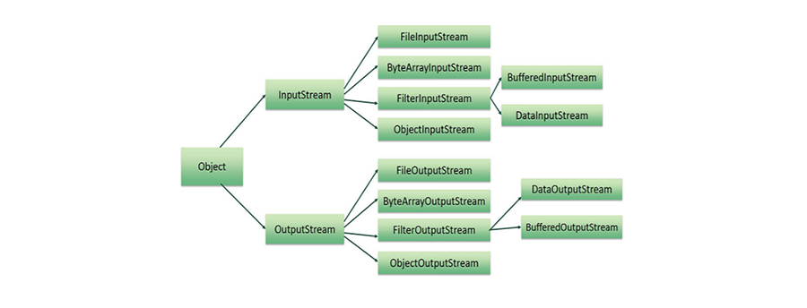

## Module 8: Managing Input/Output Files in Java

## Introduction
A **file** is a collection of related records stored on disk. Managing and storing data using files—known as **file processing**—includes creating, updating, and manipulating data. Java provides powerful features for handling file I/O at the level of **bytes**, **characters**, **fields**, or even **objects**. Reading and writing objects is known as **serialization**.

### Learning Outcomes
By the end of this module, you should be able to:
- Explain the difference between **Byte Stream** and **Character Stream**
- Implement the **Serializable interface** for object stream support
- Use code to manage **text streams**
- Understand and apply **De-Serialization** in Java

### Key Terms and Concepts

- **File**  
  Reading from and writing to files in Java.

- **Stream**  
  A sequence of data elements supporting operations for input/output processing.

- **XML**  
  Extensible Markup Language, a text-based format for exchanging data between applications.

- **Serialization**  
  The process of converting an object into a sequence of bytes for storage or transmission.

- **De-Serialization**  
  The process of recreating an object from a sequence of bytes.

## Java File and Stream

### Streams
A **stream** is a sequence of data. Java has two main types:
- **InputStream** – reads data from a source.
- **OutputStream** – writes data to a destination.



---

### Byte Streams
Used for reading/writing 8-bit bytes. Common classes:
- `FileInputStream`
- `FileOutputStream`

**Example:**
Copies `input.txt` to `output.txt`.

```java
FileInputStream in = new FileInputStream("input.txt");
FileOutputStream out = new FileOutputStream("output.txt");
int c;
while ((c = in.read()) != -1) {
    out.write(c);
}
```

### Character Streams
Used for reading/writing 16-bit Unicode characters. Common classes:

- `FileReader`
- `FileWriter`

**Example:**
Same as above but with character streams.

```java
FileReader in = new FileReader("input.txt");
FileWriter out = new FileWriter("output.txt");
int c;
while ((c = in.read()) != -1) {
    out.write(c);
}
```

### Character vs. Byte Streams
- **Byte Streams**: 8-bit binary data, good for audio/images.
- **Character Streams**: 16-bit Unicode, ideal for text.

### Standard Streams in Java
Java provides three predefined streams:

- `System.in` – Standard Input (keyboard)
- `System.out` – Standard Output (console)
- `System.err` – Standard Error (console)

**Example: Read until 'q' is entered**

```java
InputStreamReader cin = new InputStreamReader(System.in);
char c;
do {
    c = (char) cin.read();
    System.out.print(c);
} while(c != 'q');
```

## Reading and Writing Files

As described earlier, a **stream** is a sequence of data.

- `InputStream`: Reads data from a source.
- `OutputStream`: Writes data to a destination.

These are the two most commonly used classes for file input and output in Java:

- **FileInputStream**: Reads raw byte data from a file.
- **FileOutputStream**: Writes raw byte data to a file.

### FileInputStream

`FileInputStream` is used to read data from files in byte format.

#### Creating a FileInputStream

You can create an instance of `FileInputStream` using either:

1. **A file name as a string**:

```java
InputStream f = new FileInputStream("C:/java/hello");
```

#### A `File` object:

    File file = new File("C:/java/hello");
    InputStream f = new FileInputStream(file);

### Common Methods
Once you have a `FileInputStream` object, you can use the following methods:

- `int read()`: Reads a single byte.
- `int read(byte[] b)`: Reads bytes into an array.
- `int available()`: Returns the number of bytes that can be read.
- `void close()`: Closes the stream and releases resources.

### InputStream Methods

Here are commonly used methods of the `InputStream` class in Java:

#### 1. `public void close() throws IOException`
- **Description**: Closes the file input stream.
- **Effect**: Releases any system resources associated with the file.
- **Throws**: `IOException`

---

#### 2. `protected void finalize() throws IOException`
- **Description**: Ensures the stream is closed when it is no longer referenced.
- **Effect**: Cleans up the connection to the file.
- **Throws**: `IOException`

---

#### 3. `public int read(int r) throws IOException`
- **Description**: Reads a single byte of data from the input stream.
- **Returns**: The next byte of data as an `int`; returns `-1` if end of file is reached.

---

#### 4. `public int read(byte[] r) throws IOException`
- **Description**: Reads bytes into the specified array.
- **Returns**: The total number of bytes read; returns `-1` if end of file is reached.

---

#### 5. `public int available() throws IOException`
- **Description**: Returns the number of bytes that can be read from the input stream without blocking.
- **Returns**: An `int` representing the number of available bytes.

---

### Additional Input Stream Types
- [ByteArrayInputStream](https://www.tutorialspoint.com/java/java_bytearrayinputstream.htm)
- [DataInputStream](https://www.tutorialspoint.com/java/java_datainputstream.htm)

## FileOutputStream in Java

`FileOutputStream` is used to create and write data to a file in Java. If the specified file does not exist, the stream will create it before writing.

### Constructors

#### 1. Using a file name (as a string)
```java
OutputStream f = new FileOutputStream("C:/java/hello");
```

Creates a `FileOutputStream` to write to the file named `"C:/java/hello"`.

### Using a `File` object

    File f = new File("C:/java/hello");
    OutputStream f = new FileOutputStream(f);

First, a `File` object is created, and then the `FileOutputStream` is initialized with it.

### Common Use
Once you have a `FileOutputStream` object, you can use various helper methods (like `write()`, `close()`, etc.) to write data and manage the stream.

## FileOutputStream Methods in Java

### 1. `public void close() throws IOException`
- **Description**: Closes the file output stream.
- **Effect**: Releases any system resources associated with the file.
- **Throws**: `IOException`

---

### 2. `protected void finalize() throws IOException`
- **Description**: Called by the garbage collector on an object when garbage collection determines that there are no more references to the object.
- **Effect**: Ensures that the stream is properly closed.
- **Throws**: `IOException`

---

### 3. `public void write(int w) throws IOException`
- **Description**: Writes the specified byte to the output stream.
- **Parameter**: `w` – the byte to be written.
- **Throws**: `IOException`

---

### 4. `public void write(byte[] w)`
- **Description**: Writes `w.length` bytes from the specified byte array to the output stream.
- **Parameter**: `w` – the data.

---

### Additional Output Stream Types
- [ByteArrayOutputStream](https://www.tutorialspoint.com/java/java_bytearrayoutputstream.htm)
- [DataOutputStream](https://www.tutorialspoint.com/java/java_dataoutputstream.htm)

## Example: Using InputStream and OutputStream

This example demonstrates basic file I/O using `FileOutputStream` and `FileInputStream`:

```java
import java.io.*;

public class fileStreamTest {
   public static void main(String args[]) {
      try {
         byte bWrite[] = {11, 21, 3, 40, 5};

         OutputStream os = new FileOutputStream("test.txt");
         for (int x = 0; x < bWrite.length; x++) {
            os.write(bWrite[x]); // writes the bytes
         }
         os.close();

         InputStream is = new FileInputStream("test.txt");
         int size = is.available();

         for (int i = 0; i < size; i++) {
            System.out.print((char) is.read() + " ");
         }

         is.close();
      } catch (IOException e) {
         System.out.print("Exception");
      }
   }
}
```

#### Description:
Creates a file `test.txt`

- Writes a byte array `{11, 21, 3, 40, 5}` to the file
- Reads back and prints the bytes as characters to standard output

### File Navigation and I/O
There are several other classes that we would be going through to get to know the basics of File Navigation and I/O.

- File Class
- FileReader Class
- FileWriter Class

## Directories in Java

In Java, a **directory** is treated as a `File` object that can contain other files and directories. You can use the `java.io.File` class to:


- Create directories
- List files and subdirectories
- Check if a directory exists
- Delete directories (only if empty)

### Creating Directories in Java

Java provides two methods from the `File` class to create directories:

#### 1. `mkdir()`
- Creates a **single** directory.
- Returns `true` if the directory was created successfully.
- Returns `false` if the directory already exists or the full path is not available.

#### 2. `mkdirs()`
- Creates the directory **and** all non-existent parent directories.
- Useful for creating nested directory structures.

---

#### Example: Create Nested Directory

```java
import java.io.File;

public class CreateDir {
   public static void main(String args[]) {
      String dirname = "/tmp/user/java/bin";
      File d = new File(dirname);

      // Create the directory structure
      d.mkdirs();
   }
}
```

This code creates the directory `/tmp/user/java/bin` along with all necessary parent directories if they do not already exist.

## Listing Directories in Java

To list files and directories within a specified directory, use the `list()` method of the `File` class.

### Example: List Contents of a Directory

```java
import java.io.File;

public class ReadDir {

   public static void main(String[] args) {

      File file = null;
      String[] paths;

      try {
         // Create new file object for the directory
         file = new File("/tmp");

         // Get array of files and directories
         paths = file.list();

         // Iterate and print each file or directory name
         for (String path : paths) {
            System.out.println(path);
         }

      } catch (Exception e) {
         // Handle any errors
         e.printStackTrace();
      }
   }
}
```

#### Notes:
- The `list()` method returns an array of `String` filenames in the directory.
- Use `listFiles()` instead if you need `File` objects with more file information.

This will produce the following result based on the directories and files available in your /tmp directory −

**Output**

- test1.txt
- test2.txt
- ReadDir.java
- ReadDir.class
## Sequential Text File in Java

A **Sequential Data File** is a file where data is stored and accessed in order, from start to end. These are often plain text files (`.txt`) and are commonly used for data that is read or written line-by-line.

- Data is accessed **sequentially**, meaning the file must be read from the beginning up to the desired point.
- Typically stored on sequential access storage devices (e.g., magnetic tape).
- Can be created, read, and written using Java and other languages.

---

### Working with Files in Java

Java provides the `File` class from the `java.io` package to interact with files and directories.

### Example:

```java
import java.io.File; // Import the File class

public class Main {
   public static void main(String[] args) {
      File myObj = new File("filename.txt"); // Create File object
      // Additional operations can be done on the file
   }
}
```

You can then use methods like:

- `createNewFile()` to create a file
- `exists()` to check if it exists
- `delete()` to delete the file
- `length()` to get file size
- `getName()`, `getAbsolutePath()`, etc.

| **Method**           | **Type**   | **Description**                                      |
|----------------------|------------|------------------------------------------------------|
| `canRead()`          | Boolean    | Tests whether the file is readable or not           |
| `canWrite()`         | Boolean    | Tests whether the file is writable or not           |
| `createNewFile()`    | Boolean    | Creates an empty file                               |
| `delete()`           | Boolean    | Deletes a file                                      |
| `exists()`           | Boolean    | Tests whether the file exists                       |
| `getName()`          | String     | Returns the name of the file                        |
| `getAbsolutePath()`  | String     | Returns the absolute pathname of the file           |
| `length()`           | Long       | Returns the size of the file in bytes               |
| `list()`             | String[]   | Returns an array of the files in the directory      |
| `mkdir()`            | Boolean    | Creates a directory                                 |

## Create/Write Java Files

To create a file in Java, you can use the `createNewFile()` method. This method returns a boolean value:  
- `true` if the file was successfully created  
- `false` if the file already exists  

It must be enclosed in a `try...catch` block since it throws an `IOException` if an error occurs.

### Example

```java
import java.io.File;       // Import the File class
import java.io.IOException; // Import the IOException class

public class CreateFile {
   public static void main(String[] args) {
      try {
         File myObj = new File("filename.txt");
         if (myObj.createNewFile()) {
            System.out.println("File created: " + myObj.getName());
         } else {
            System.out.println("File already exists.");
         }
      } catch (IOException e) {
         System.out.println("An error occurred.");
         e.printStackTrace();
      }
   }
}
```

**Output**

    File created: filename.txt

To create a file in a specific directory (requires permission), specify the path.

- On **Windows**, use double backslashes: `"C:\\Users\\Name\\filename.txt"`
- On **macOS/Linux**, just write the path: `"/Users/name/filename.txt"`

**Example**

    File myObj = new File("C:\\Users\\MyName\\filename.txt");

## Writing to a File in Java

To write to a file, use the `FileWriter` class and its `write()` method.  
After writing, always close the file using the `close()` method.

### Example

```java
import java.io.FileWriter;   // Import the FileWriter class
import java.io.IOException;  // Import the IOException class

public class WriteToFile {
   public static void main(String[] args) {
      try {
         FileWriter myWriter = new FileWriter("filename.txt");
         myWriter.write("Files in Java might be tricky, but it is fun enough!");
         myWriter.close();
         System.out.println("Successfully wrote to the file.");
      } catch (IOException e) {
         System.out.println("An error occurred.");
         e.printStackTrace();
      }
   }
}
```

**Output:**

    Successfully wrote to the file.

**Note:** This will overwrite the file if it already exists. Use `FileWriter("filename.txt", true)` to append instead.

## Reading a File in Java

To read the contents of a file, use the `Scanner` class with a `File` object.  
Wrap the logic in a try-catch block to handle `FileNotFoundException`.

### Example

```java
import java.io.File;                 // Import the File class
import java.io.FileNotFoundException; // For handling file not found errors
import java.util.Scanner;           // To read text files

public class ReadFile {
   public static void main(String[] args) {
      try {
         File myObj = new File("filename.txt");
         Scanner myReader = new Scanner(myObj);
         while (myReader.hasNextLine()) {
            String data = myReader.nextLine();
            System.out.println(data);
         }
         myReader.close();
      } catch (FileNotFoundException e) {
         System.out.println("An error occurred.");
         e.printStackTrace();
      }
   }
}
```

**Output:**

    Files in Java might be tricky, but it is fun enough!