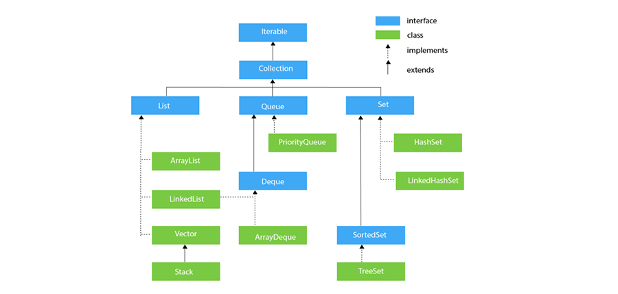

# Module 9: Collection Classes

## Introduction

The **Collection** in Java is a framework that provides architecture to store and manipulate groups of objects. Java Collections can perform operations such as searching, sorting, insertion, manipulation, and deletion. A Java Collection means a single unit of objects. The Java Collections Framework provides many interfaces and classes:

- **Interfaces**: `Set`, `List`, `Queue`, `Deque`
- **Classes**: `ArrayList`, `Vector`, `LinkedList`, `PriorityQueue`, `HashSet`, `LinkedHashSet`, `TreeSet`

### Learning Outcomes

By the end of this module, you should be able to:

- Explain the concept of the collection framework in Java
- Illustrate the functionality of Java interfaces such as `Set`, `List`, `Queue`, and `Deque`
- Explain the classes such as `ArrayList`, `Vector`, `LinkedList`, `PriorityQueue`, `HashSet`, `LinkedHashSet`, and `TreeSet` provided by the Java Collection Framework

### Key Terms and Concepts

#### Collection Framework

The **Java Collections Framework** is a collection of interfaces and classes that helps in storing and processing data efficiently.

#### Set

A `Set` is a collection that **doesn’t allow duplicates** and **doesn’t allow element access by index**. Instead, it provides methods to check if elements exist.

#### List

A `List` is a collection that **allows duplicates** and **behaves like an array** (indexing elements with integers). The first element has index `0`; the last element has index `length - 1`.

#### Queue

A `Queue` is a collection where elements are **added (pushed)** and **removed (popped)** in the order they were added — this is called **FIFO** (First In, First Out).

#### Deque

A `Deque` allows elements to be **added and removed from both ends**. The term “deque” (pronounced “deck”) is short for **double-ended queue**.

#### Vector

The `Vector` class provides capabilities similar to arrays but can **dynamically resize** itself as elements are added or removed.

#### Stack

A `Stack` is a collection where elements are **added and removed from the top**. This follows the **LIFO** (Last In, First Out) principle.

## Arrays of Primitive Data Types

An array is a collection of similar data types. An array is a container object that holds values of homogeneous types. It is also known as a static data structure because the size of an array must be specified at the time of its declaration.

An array can be either primitive or reference type. It gets memory in heap areas. The index of array starts from zero to size-1.

### Array Declaration

Syntax:

    datatype[] identifier;

or

    datatype identifier[];

Both are valid syntax for array declaration. But the former is more readable.

Example :

    int[] arr;

    char[] arr;

    short[] arr;

    long[] arr;

    int[][] arr;  // two dimensional array.

### Initialization of Array

New operator is used to initialize an array.

Example :

    int[] arr = new int[10];  // 10 is the size of array.

or

    int[] arr = {10, 20, 30, 40, 50};

### Accessing array element

As mentioned earlier, an array index starts from 0. To access the nth element of an array:

Syntax:

    arrayname[n-1];

Example: To access 4th element of a given array

    int[] arr = {10, 20, 30, 40};

    System.out.println("Element at 4th place " + arr[3]);

The above code will print the 4th element of array `arr` on console.

### foreach or enhanced for loop:

J2SE 5 introduces a special type of for loop called the **foreach loop** to access elements of an array. Using a foreach loop, you can access complete arrays sequentially without using the index of the array. Let us see an example of a foreach loop.

    class Arraydemo
    {
        public static void main(String[] args)
        {
            int[] arr = {10, 20, 30, 40};
            for (int x : arr)
            {
                System.out.println(x);
            }
        }
    }

#### Output:

    10
    20
    30
    40

## Collection Interface

The **Collection** interface is the interface which is implemented by all the classes in the collection framework. It declares the methods that every collection will have. In other words, we can say that the Collection interface builds the foundation on which the collection framework depends.

Some of the methods of the Collection interface are:

- `Boolean add(Object obj)`
- `Boolean addAll(Collection c)`
- `void clear()`

These methods are implemented by all the subclasses of the Collection interface.

There are mainly three types of collection interfaces:

- List Interface
- Queue Interface
- Set Interface

## List Interface

The **List** interface is the child interface of the Collection interface. It represents a list-type data structure in which we can store an ordered collection of objects. It can have duplicate values.

The List interface is implemented by the following classes:

- ArrayList  
- LinkedList  
- Vector  
- Stack  

To instantiate the List interface, we must use:

    List<data-type> list1 = new ArrayList();
    List<data-type> list2 = new LinkedList();
    List<data-type> list3 = new Vector();
    List<data-type> list4 = new Stack();

There are various methods in the List interface that can be used to insert, delete, and access the elements from the list.

---

### ArrayList

The ArrayList class implements the List interface. It uses a dynamic array to store duplicate elements of different data types. The ArrayList class maintains the insertion order and is non-synchronized. The elements stored in the ArrayList class can be randomly accessed.

Consider the example in the following link:  
https://www.studytonight.com/java/collection-classes.php

---

### LinkedList

LinkedList implements the Collection interface. It uses a doubly linked list internally to store the elements. It can store duplicate elements. It maintains the insertion order and is not synchronized. In LinkedList, manipulation is fast because no shifting is required.

Consider the example in the following link:  
https://www.studytonight.com/java/collection-classes.php

---

### Vector

Vector implements the List interface. Like ArrayList, it also maintains insertion order but is rarely used in non-threaded environments because it is synchronized and thus gives poor performance in searching, adding, deleting, and updating elements.

#### Three ways to create a Vector class object:

**Method 1:**

    Vector vec = new Vector();

It creates an empty Vector with the default initial capacity of 10. This means the Vector will be resized when the 11th element is inserted. By default, Vector doubles its size (e.g., from 10 to 20).

---

**Method 2:**

Syntax:

    Vector object = new Vector(int initialCapacity);

Example:

    Vector vec = new Vector(3);

Creates a Vector with an initial capacity of 3.

---

**Method 3:**

Syntax:

    Vector object = new Vector(int initialCapacity, int capacityIncrement);

Example:

    Vector vec = new Vector(4, 6);

Here, initial capacity is 4 and capacity increment is 6. So, upon inserting the 5th element, the size becomes 10 (4 + 6), and on the 11th insertion, it becomes 16 (10 + 6).

---

#### Complete Example of Vector in Java:

    import java.util.*;

    public class VectorExample {
       public static void main(String args[]) {
          /* Vector of initial capacity (size) of 2 */
          Vector<String> vec = new Vector<String>(2);

          /* Adding elements to a vector */
          vec.addElement("Apple");
          vec.addElement("Orange");
          vec.addElement("Mango");
          vec.addElement("Fig");

          /* Check size and capacity */
          System.out.println("Size is: " + vec.size());
          System.out.println("Default capacity increment is: " + vec.capacity());

          vec.addElement("fruit1");
          vec.addElement("fruit2");
          vec.addElement("fruit3");

          /* Size and capacity after additions */
          System.out.println("Size after addition: " + vec.size());
          System.out.println("Capacity after increment is: " + vec.capacity());

          /* Display Vector elements */
          Enumeration en = vec.elements();
          System.out.println("\nElements are:");
          while (en.hasMoreElements())
              System.out.print(en.nextElement() + " ");
       }
    }

**Output:**

    Size is: 4
    Default capacity increment is: 4
    Size after addition: 7
    Capacity after increment is: 8
    Elements are:
    Apple Orange Mango Fig fruit1 fruit2 fruit3

---

### Stack

The Stack class is a subclass of Vector. It implements the last-in-first-out (LIFO) data structure. The stack contains all the methods of the Vector class and also provides its own methods like `push()`, `peek()`, etc.

#### Example:

    import java.util.*;

    public class StackBasicExample {
       public static void main(String a[]) {
          Stack<Integer> stack = new Stack<>();

          System.out.println("Empty stack : " + stack);
          System.out.println("Empty stack : " + stack.isEmpty());

          // Uncommenting the following line will cause java.util.EmptyStackException
          // System.out.println("Empty stack : Pop Operation : " + stack.pop());

          stack.push(1001);
          stack.push(1002);
          stack.push(1003);
          stack.push(1004);

          System.out.println("Non-Empty stack : " + stack);
          System.out.println("Non-Empty stack: Pop Operation : " + stack.pop());
          System.out.println("Non-Empty stack : After Pop Operation : " + stack);
          System.out.println("Non-Empty stack : search() Operation : " + stack.search(1002));
          System.out.println("Non-Empty stack : " + stack.isEmpty());
       }
    }

**Output:**

    Empty stack : []
    Empty stack : true
    Non-Empty stack : [1001, 1002, 1003, 1004]
    Non-Empty stack: Pop Operation : 1004
    Non-Empty stack : After Pop Operation : [1001, 1002, 1003]
    Non-Empty stack : search() Operation : 2
    Non-Empty stack : false

## Queue Interface

The **Queue** interface maintains the first-in-first-out (FIFO) order. It can be defined as an ordered list that is used to hold the elements which are about to be processed. There are various classes like **PriorityQueue**, **Deque**, and **ArrayDeque** which implement the Queue interface.

Queue interface can be instantiated as:

    Queue<String> q1 = new PriorityQueue<>();
    Queue<String> q2 = new ArrayDeque<>();

There are various classes that implement the Queue interface:

- PriorityQueue
- Deque
- ArrayDeque

---

### Priority Queue

The **PriorityQueue** class implements the Queue interface. It holds the elements or objects which are to be processed by their priorities. PriorityQueue doesn't allow null values to be stored in the queue.

Consider the example in the following link:  
https://www.studytonight.com/java/collection-classes.php

---

### Deque Interface

The **Deque** interface extends the Queue interface. In Deque, we can remove and add the elements from both sides. Deque stands for a double-ended queue which enables us to perform the operations at both the ends.

Deque can be instantiated as:

    Deque<String> d = new ArrayDeque<>();

---

### ArrayDeque

The **ArrayDeque** class implements the Deque interface. It facilitates the use of the Deque. Unlike queue, we can add or delete the elements from both the ends.

ArrayDeque is faster than ArrayList and Stack and has no capacity restrictions.

---

### Example:

    import java.util.*;

    public class TestJavaCollection6 {
        public static void main(String[] args) {
            // Creating Deque and adding elements
            Deque<String> deque = new ArrayDeque<String>();

            deque.add("A");
            deque.add("B");
            deque.add("D");

            // Traversing elements
            for (String str : deque) {
                System.out.println(str);
            }
        }
    }

---

### Output:

    A
    B
    D

## Set Interface

Set Interface in Java is present in `java.util` package. It extends the Collection interface. It represents an unordered set of elements which doesn't allow storing duplicate items. We can store at most one null value in a Set. Set is implemented by **HashSet**, **LinkedHashSet**, and **TreeSet**.

Set can be instantiated as:

    Set<data-type> s1 = new HashSet<data-type>();
    Set<data-type> s2 = new LinkedHashSet<data-type>();
    Set<data-type> s3 = new TreeSet<data-type>();

---

### HashSet

HashSet class implements Set Interface. It represents a collection that uses a hash table for storage. Hashing is used to store the elements in the HashSet. It contains unique items.

Consider the example in the following link:  
https://www.studytonight.com/java/collection-classes.php

---

### LinkedHashSet

LinkedHashSet class represents the LinkedList implementation of Set Interface. It extends the HashSet class and implements the Set interface. Like HashSet, it also contains unique elements. It maintains the insertion order and permits null elements.

Consider the example in the following link:  
https://www.studytonight.com/java/collection-classes.php

---

### SortedSet Interface

SortedSet is an alternative to the Set interface that provides a total ordering on its elements. The elements of the SortedSet are arranged in increasing (ascending) order. The SortedSet provides additional methods that enforce the natural ordering of the elements.

The SortedSet can be instantiated as:

    SortedSet<data-type> set = new TreeSet<>();

---

### TreeSet

Java TreeSet class implements the Set interface that uses a tree for storage. Like HashSet, TreeSet also contains unique elements. However, the access and retrieval time of TreeSet is quite fast. The elements in TreeSet are stored in ascending order.

Consider the example in the following link:  
https://www.studytonight.com/java/collection-classes.php

## Summary

The Java collections framework gives the programmer access to prepackaged data structures as well as to algorithms for manipulating them. A collection is an object that can hold references to other objects. The collection interfaces declare the operations that can be performed on each type of collection. The classes and interfaces of the collections framework are in package `java.util`.
