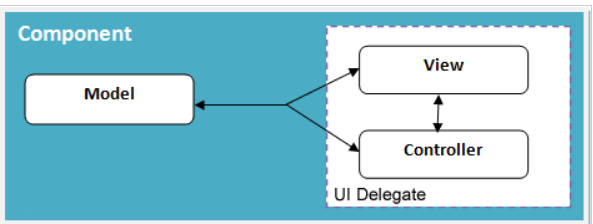

# Module 12: GUI and Introduction to Java Swing

## Introduction
Swing is a lightweight Graphical User Interface (GUI) toolkit for Java. It is part of Oracle’s Java Foundation Classes and was developed to provide a more sophisticated set of GUI components than earlier Abstract Window Toolkits (AWT). Java Swing offers a look and feel that emulates several other platforms. Besides common components like buttons, checkboxes, and labels, Swing provides advanced components such as tabbed panels, scroll panes, tables, and lists.

### Learning Outcomes
By the end of this module, you should be able to:
- Explain the concept of JAVA GUI and JAVA Swing.
- Illustrate JAVA Swing examples in Eclipse.

### Key Terms and Concepts

- **GUI**  
  The graphical user interface is a form of user interface that allows users to interact with electronic devices through graphical icons and audio indicators such as primary notation.

- **Swing**  
  Swing is a GUI widget toolkit for Java. It is part of Oracle's Java Foundation Classes (JFC) – an API for providing a graphical user interface (GUI) for Java programs.

- **AWT**  
  AWT stands for Abstract Window Toolkit. It is a platform-dependent API for creating Graphical User Interface (GUI) for Java programs.

- **MVC**  
  The Model-View-Controller (MVC) is an architectural pattern that separates an application into three main logical components: the model, the view, and the controller.

## GUI [Graphical User Interface] Java - Summary (Point Form)

- GUI allows users to interact with electronic devices via graphical icons, menus, and visual indicators.
- It uses pointing devices like mouse, trackball, stylus, or touch screens for interaction.
- GUI differs from text-based interfaces where commands are typed as text.
- Early computer interfaces relied on text prompts (e.g., DOS prompt), which were inefficient and error-prone.
- GUI was developed to make interaction more user-friendly and efficient.
- Java provides GUI capabilities primarily through the Swing toolkit.
- Swing offers a rich set of components for building sophisticated Java GUIs.

## Introduction to Swing - Summary (Point Form)

- Java Swing is part of the Java Foundation Classes (JFC).
- It is designed for large-scale enterprise Java application development.
- Swing provides APIs for building graphical user interfaces (GUIs) in Java programs.
- Also known as the Java GUI widget toolkit.
- Swing was developed based on the earlier Abstract Window Toolkit (AWT).
- Offers richer and more sophisticated GUI components compared to AWT.
- Components range from simple labels to complex trees and tables.
- Supports emulating the look and feel of various platforms.
- Provides a pluggable look and feel, allowing Java GUIs to have platform-independent appearance.

## Swing Architecture - Summary (Point Form)

- Swing is platform independent and uses an enhanced MVC (Model-View-Controller) framework.

- **Pluggable Look and Feel:**
  - Supports multiple look and feels: Windows, UNIX, Motif, and native Java Metal.
  - Users can switch look and feel at runtime without restarting the application.
- **Lightweight Components:**
  - Most Swing components are lightweight, except some top-level containers.
  - Lightweight means components render themselves using Graphics primitives, not relying on OS.
  - This results in faster rendering and less memory consumption compared to previous GUI toolkits.
- **Simplified MVC (Model-Delegate):**
  - Each Swing component consists of a model and a UI delegate.
  - The UI delegate acts as the view and controller, responsible for painting and handling GUI events.
  - The model maintains the component's data and state.
  
# Additional Resources
- [Swing Packages](https://www.zentut.com/java-swing/introduction-to-java-swing/)
- [Swing Example](https://www.javatpoint.com/java-swing)

## Summary (Point Form)

- Created a simple graphical user interface (GUI) using Java Swing.
- Added basic back-end functionality to the GUI.
- Coded the behavior of buttons and input fields in a Swing form.
- Worked through layout and design of the GUI.
- Added buttons and text fields to the GUI.
- Used text fields to receive user input and display output.
- Configured buttons to initiate front-end functionality.
